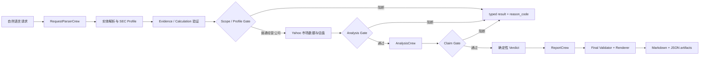

# StockCrewAI

[](https://github.com/Blake-Ye/StockCrewAI/actions/workflows/test.yml)
[](https://www.python.org/)
[](LICENSE)

StockCrewAI 是一个基于 CrewAI Flow 的可审计投研 Agent 原型：它把自然语言公司研究请求转换为带 SEC/市场证据、确定性计算、门禁和 Markdown 报告的研究流程。

面向普通经营类美国上市公司。输出是研究初稿，不是投资建议；不承诺覆盖所有美股，也不承诺 SEC、Yahoo、DeepSeek 等外部服务每次可用。

## 为什么值得看

- **3 Crew / 4 Agent**：请求解析、财务与风险分析、报告组织各有边界。
- **LLM 只做语言工作**：解析请求、解释已验证事实、组织叙述，不决定来源、数字或评级。
- **Python + `Decimal` 控制可信路径**：负责数据选择、计算、验证、Gate、Verdict 和报告数字渲染。
- **Evidence → Calculation → Claim 可追溯**：每个进入分析的数字都要回到已验证的来源 ID。
- **typed failure + `reason_code`**：外部服务、数据契约和范围阻断都保留机器可读的定位信息。
- **离线测试不触网**：默认使用 fixture、替身和依赖注入，不调用 SEC、Yahoo 或 DeepSeek。

## 数据流



## 快速开始

项目使用 `uv` 管理环境，要求 Python `>=3.10,<3.14`。已有锁文件时，先准备开发依赖：

```bash
uv sync --group dev
```

### 配置真实运行

将以下变量写入本地 `.env`，不要提交 `.env` 或任何凭据：

| 变量 | 用途 | 是否必需 |
| --- | --- | --- |
| `DEEPSEEK_API_KEY` | DeepSeek 模型认证 | 必需 |
| `DEEPSEEK_BASE_URL` | OpenAI-compatible 服务地址，当前为 `https://api.deepseek.com/v1` | 必需 |
| `EDGAR_IDENTITY` | SEC EDGAR 请求的身份/User-Agent 联系信息 | 必需 |
| `EDGAR_HTTP_TIMEOUT` | 单次 SEC 请求超时 | 可选 |
| `CREWAI_STORAGE_DIR` | CrewAI 本地运行时存储目录 | 受限环境可选 |

配置后执行真实研究 Flow：

```bash
set -a
source .env
set +a
STOCKCREWAI_REQUEST='分析苹果公司未来 3 年投资价值' uv run --no-sync crewai run
```

需要使用项目脚本入口时，也可执行 `uv run --no-sync kickoff`；它对应 `pyproject.toml` 中的 `kickoff`。

真实运行依赖外部服务；数据不足、模型输出不符合契约或证券不在支持范围时，会返回结构化状态，不补零、不补造数据。

### 运行离线测试

离线门禁使用 fixture 或依赖注入，不需要真实模型、SEC 或市场凭据：

```bash
uv run --no-sync pytest -q
```

## 3 个 Crew、4 个 Agent

| Crew | Agent | 职责边界 |
| --- | --- | --- |
| `RequestParserCrew` | `RequestParserAgent` | 解析公司候选、ticker、关注方向、语言和投资期限；不确认 CIK、不查网、不生成财务数字。 |
| `AnalysisCrew` | `FinancialQualityAgent` | 解释已验证的财务 Evidence/Calculation，生成带来源 ID 的财务 Claim。 |
| `AnalysisCrew` | `RiskAnalysisAgent` | 只解释已验证的 SEC filing 风险文本，生成带 Evidence ID 的风险 Claim。 |
| `ReportCrew` | `ReportWriterAgent` | 组织无数字叙述草稿；最终数字、状态、来源和 Verdict 由 Python Renderer 注入。只有 Verdict 已就绪且报告守卫重试耗尽时，才允许改用不含动态事实的确定性安全草稿。 |

估值、验证、Gate、Verdict 和报告数字不交给 LLM 决定。Flow 通过 `ResearchFlowState` 传递跨阶段状态，Crew 不直接修改下游 Crew 的输入。

## 支持范围与阻断语义

主线路面向单家、已在 SEC 申报的普通经营类美国上市公司。SEC/证券元数据先经过确定性的 SIC/Profile Gate，再决定指标是 `required`、`available`、`unavailable` 还是 `not_applicable`。

以下类别当前在主流程中阻断：

| 类别 | 识别范围或依据 | 稳定原因码 |
| --- | --- | --- |
| 银行 | SIC `6020–6022` | `unsupported_category_sic` |
| 保险 | SIC `6300–6399` | `unsupported_category_sic` |
| REIT | SIC `6798` | `unsupported_category_sic` |
| 公用事业 | SIC `4900–4999` | `unsupported_category_sic` |
| 商品生产商/采掘类 | SIC `1000–1499` | `unsupported_category_sic` |
| ETF、共同基金、封闭式基金等基金证券 | SEC 投资公司元数据和证券 Profile | `unsupported_security` |

ADR、SPAC 等非 `standard_operating` 证券先分类，当前不套用普通经营公司报告。范围门禁发生在 SEC 基础证据验证之后、Yahoo 市场价格之前；被阻断时不会继续调用 Yahoo、估值、Analysis 或 Report。阻断是结构化业务结果，不是程序崩溃。

`not_applicable` 不等于零；适用但证据不足时是 `unavailable`；必需数据或输出契约未满足时是 `blocked`。阻断或空报告不会生成替代数据，也不会覆盖已有正式报告。

## Coverage

`coverage` 描述本次运行的证据和 Profile 结果，不代表所有证券都能得到同一种估值报告：

| coverage | 语义 |
| --- | --- |
| `full` | 核心 Evidence、适用指标和必要计算均已验证，可输出完整的适用研究内容与确定性结论。 |
| `partial` | 有足够证据继续研究，但部分指标、历史或估值模型缺失或不适用；报告必须明确限制。 |
| `evidence_only` | 证据足以描述公司或风险，但不足以形成估值结论；不生成伪造估值或确定性评级。 |
| `unsupported_security` | 输入不是当前线路支持的普通股证券；返回结构化范围说明，不套用股票报告。 |

## 入口与运行产物

`pyproject.toml` 将项目声明为 CrewAI `flow`：`crewai run` 是真实研究入口；脚本入口 `kickoff` 指向 `stockcrewai.main:kickoff`，`plot` 指向 `stockcrewai.main:plot`。`src/stockcrewai/flow.py` 是 Flow 编排，`src/stockcrewai/main.py` 负责 `run_research()`、运行产物和兼容入口。

`crewai flow plot` 或 `plot` 只生成 Flow 图，不执行 SEC、Yahoo 或 DeepSeek 研究，也不生成研究报告。

研究链路是请求解析 → SEC 公司/Facts/filing → Evidence 与财务验证 → 市场价格与估值 → Analysis/Claim Gate → Verdict → Report → 最终验证；任何外部服务或数据契约失败都保留 typed 状态和原因。

默认运行产物写入当前工作目录；传入自定义 `output_path` 时写入对应目录：

| 文件 | 作用 |
| --- | --- |
| `run-output.md` | 脱敏、无 ANSI 的人类摘要：阶段、证据/计算数量、Gate 状态、阻断原因和下一步。 |
| `run-result.json` | JSON-safe 机器结果，用于审计和排错；成功报告时包含报告 manifest。 |
| `investment-report.md` | 只有 `status=ok`、`stage=report` 且正文非空时才原子写入的正式 Markdown。 |

这些是本地运行产物，默认不应提交。报告导出成功后，`run-result.json` 记录相对文件名、SHA-256 和字节数。

## Typed failure 与排错

排错时先看 `status` 和 `stage`，再看 `required_data`、`error.category`/`error.reason_code`，以及 `analysis_diagnostics.domain`/`reason_code`；Profile 场景再看 `profile.coverage_level`、`policy_context.gate` 和指标决策。`reason_code` 是机器可读的稳定根因，不要只看自然语言 warning，也不要用零、空字符串或旧值掩盖 `unavailable`。

| 失败域 | 典型定位 | 不要混淆为 |
| --- | --- | --- |
| SEC | `sec_timeout`、`sec_unavailable`、facts/filing 阶段失败，通常属于 `external_dependency`。 | Python 公式错误或 Yahoo 行情错误。 |
| Yahoo/市场 | `yahoo_rate_limit`、`market_price_unavailable`、市场价格或历史行情阶段失败。 | SEC 证据缺失或模型输出失败。 |
| LLM/输出契约 | 请求解析、Analysis 或 Report 阶段 JSON 不可解析、`analysis_output_unparseable`、`claims_empty`。 | 把 Agent 的文字当成已验证数字，或把外部数据失败归因给 SEC。 |
| 代码/运行时 | `runtime`、`result_not_mapping` 或未满足内部契约的 Python 异常。 | 正常的 `not_applicable` 或外部服务限流。 |
| Profile/门禁 | `profile_classification_partial`、`unsupported_category_sic`、`unsupported_security` 或 Gate 阻断。 | 认为所有指标对所有证券都必须存在，或把类别不支持写成指标 `missing`。 |

外部失败不会被零值、旧值或虚构数据掩盖。Yahoo 工具允许在同一数据源内执行有界重试和行情端点切换；只有 Verdict 已就绪且 Report Guardrail 重试耗尽时，报告阶段才允许使用不含动态事实的确定性安全草稿，并记录 `draft_source=deterministic_safe_draft` 与 `reason_code=report_guardrail_retries_exhausted`。其他 Provider、Schema、Renderer 或最终验证错误均 fail closed，返回 typed error 而不生成正式报告。

## 测试与真实性边界

默认测试覆盖成功、部分数据、不可适用、输出契约错误和阻断路径，使用 fixture、替身和依赖注入。离线测试通过只说明本地确定性路径和测试契约成立，不等于真实 SEC、Yahoo 或 DeepSeek 已验证可用。

真实网络运行必须单独观察外部服务、TLS、限流和凭据配置；这些问题不能作为离线代码通过的证据。图片等测试 artifact 应写入临时目录，不污染仓库。

## 面试阅读顺序

1. 本 README：先看信任边界、数据流和 coverage。
2. `src/stockcrewai/flow.py`：看 `@start`、`@listen`、`@router` 如何编排 Evidence、Gate、Analysis 和 Report。
3. `src/stockcrewai/main.py`：看 `run_research()`、`kickoff()`、`plot()` 和 artifact 行为。
4. `src/stockcrewai/crews/`：看 3 个 Crew 与 4 个 Agent 的最小职责；再看 `tools/`、`models/`、`validators/` 的确定性边界。
5. 正式文档索引：按需查看架构、数据契约、数值约定、测试和错误模型。

## 正式文档

- [项目目标与约束](docs/Expectayion_Projects.md)
- [当前架构](docs/architecture.md)
- [数据契约](docs/data-contracts.md)
- [求职演示脚本](docs/demo-script.md)
- [依赖政策](docs/dependency-policy.md)
- [错误模型与阻断语义](docs/error-model.md)
- [财务数值约定](docs/numeric-conventions.md)
- [测试策略](docs/testing-strategy.md)

## License

本项目按 MIT License 发布，详见 [LICENSE](LICENSE)。
