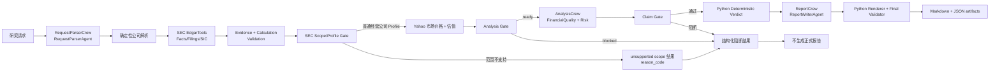

# StockCrewAI

StockCrewAI 是一个基于 CrewAI Flow 的 evidence-backed 投研原型：它把自然语言研究请求转换为可审计的 SEC、市场数据、财务计算、行业类别门禁和报告。当前发布版主要面向 SIC 识别为普通经营公司的美国上市公司，不承诺覆盖所有美股或未来收益。

## 先看结论

- LLM 只负责请求解析、已验证事实的解释和报告叙述组织。
- Python 确定性内核负责实体与证券 Profile、SEC/市场数据选择、Evidence/Calculation、`Decimal` 计算、验证、Analysis Gate、Claim Gate、Verdict 以及报告数字渲染。
- 离线测试使用替身、fixture 或注入数据，默认不访问 SEC、Yahoo、DeepSeek 或付费 API。
- 真实运行需要外部服务和本地配置；数据不足、模型输出不合约或 Profile 不适用时，结果会保留结构化状态，不补零、不补造数据。

项目定位是可审计的研究初稿，不是交易建议、收益保证或收益预测系统。

## 当前发布状态

| 范围 | 可以说明 | 不能据此说明 |
| --- | --- | --- |
| 当前已验证的本地能力 | Flow 编排、3 个 Crew/4 个 Agent 边界、确定性数据与计算契约、Profile/Gate/报告 artifact 契约，以及默认离线测试路径。 | 真实 SEC、Yahoo 或 DeepSeek 服务当前可用。 |
| 离线演示 | 使用替身、fixture 和临时存储复现成功、部分数据、不可适用和阻断路径。 | 离线数字是实时行情、SEC 最新数据或未来收益。 |
| 真实网络运行 | 在本地配置外部服务后运行完整链路，并把外部失败保留为 typed 状态。 | 所有证券都能 `full`，或任何运行一定生成正式报告。 |

## 环境与配置

前提：安装 `uv` 并使其可在 shell 中调用；项目要求 Python `>=3.10,<3.14`。已有锁文件时，首次准备开发环境：

```bash
uv sync --group dev
```

离线检查和运行均使用 `uv run --no-sync`，避免运行时修改依赖环境。真实运行的最小 `.env` 变量如下；只在本地填写值，不要把 `.env` 或任何凭据提交到 Git：

| 变量 | 用途 | 真实运行 |
| --- | --- | --- |
| `DEEPSEEK_API_KEY` | DeepSeek 模型认证 | 必需 |
| `DEEPSEEK_BASE_URL` | OpenAI-compatible 服务地址；当前配置使用 `https://api.deepseek.com/v1` | 必需 |
| `EDGAR_IDENTITY` | SEC EDGAR 请求的身份/User-Agent 联系信息 | 必需 |
| `EDGAR_HTTP_TIMEOUT` | 单次 SEC 请求超时；按需设置 | 可选 |

离线测试不需要真实模型、SEC 或市场凭据；离线验证命令会显式设置非秘密占位值，测试使用 fixture 或依赖注入。真实运行仍按上面的 `.env` 配置执行。

## 3 个 Crew、4 个 Agent

| Crew | Agent | 职责边界 |
| --- | --- | --- |
| `RequestParserCrew` | `RequestParserAgent` | 解析公司候选、ticker、关注方向、语言和投资期限；不确认 CIK、不查网、不生成财务数字。 |
| `AnalysisCrew` | `FinancialQualityAgent` | 解释已验证财务 Evidence/Calculation，生成带来源 ID 的财务 Claim。 |
| `AnalysisCrew` | `RiskAnalysisAgent` | 只解释已验证 SEC filing 风险文本，生成带 Evidence ID 的风险 Claim。 |
| `ReportCrew` | `ReportWriterAgent` | 组织无数字叙述草稿；最终数字、状态、来源和 Verdict 由 Python Renderer 注入。 |

估值、验证和 Verdict 没有额外 LLM Agent。Agent 不能自行选 SEC 文件、决定 CIK、重新计算、补齐数字、修改 Gate 或生成最终评级。

## 数据流



主入口是 `src/stockcrewai/main.py` 的 `run_research()`、`kickoff()` 和 `plot()`；Flow 编排位于 `src/stockcrewai/flow.py`。数据选择、公式、验证和门禁不由 Agent 决定。

## Coverage 与证券边界

每次运行的 coverage 是本次证据和 Profile 的结构化结果，不代表所有证券都能得到同一种估值报告：

| coverage | 语义 |
| --- | --- |
| `full` | 核心 Evidence、适用指标和必要计算均已验证，可输出完整的适用研究内容与确定性结论。 |
| `partial` | 有足够证据继续研究，但部分指标、历史或估值模型缺失或不适用；报告必须明确限制。 |
| `evidence_only` | 证据足以描述公司或风险，但不足以形成估值结论；不生成伪造估值或确定性评级。 |
| `unsupported_security` | 输入不是当前线路支持的普通股证券；返回结构化范围说明，不套用股票报告。 |

### SEC Scope/Profile 门禁与 SIC 行业类别

SEC/EdgarTools 提供公司的 SIC 行业代码以及证券/申报元数据；项目将这些输入规范化后交给确定性的 Profile Registry，不由 LLM 猜测公司类别。当前以下 SIC 范围在真实主流程中直接阻断：

| SIC 范围 | 类别 | 阻断原因 |
| --- | --- | --- |
| `6020–6022` | 银行 | `unsupported_category_sic` |
| `6300–6399` | 保险 | `unsupported_category_sic` |
| `6798` | REIT | `unsupported_category_sic` |
| `4900–4999` | 公用事业 | `unsupported_category_sic` |
| `1000–1499` | 商品生产商/采掘类 | `unsupported_category_sic` |

普通经营公司的 SIC 不落入上述范围，并且 SEC 申报、证券类型和必要证据满足 Profile 条件时，才进入市场价格、估值和 Analysis Crew。ETF、共同基金和封闭式基金也在同一个 `SEC Scope/Profile Gate` 中阻断，稳定原因码为 `unsupported_security`。它们的识别依据是 SEC 投资公司元数据和证券 Profile，不一定只靠 SIC；因此统一的是线路和出口，不能混淆原因码。

统一范围门禁发生在 SEC 证据与基础验证之后、Yahoo 市场价格之前。因此，系统仍需先访问 SEC 获取 SIC/证券元数据，但不会为被阻断类别调用 Yahoo、估值工具、Analysis Crew 或 Report Crew。

典型 JPM 阻断输出：

```text
status=BLOCKED
domain=scope
reason_code=unsupported_category_sic
required_data=unsupported_category_sic:sic=6022, unsupported_category_sic:issuer_profile=bank
```

这表示“银行类别不在当前普通经营公司主线支持范围”，不是银行指标缺失。Profile policy 会先判断发行人、证券结构和申报制度，再决定指标是 `required`、`available`、`unavailable` 还是 `not_applicable`。`not_applicable` 不是失败，也不能被当成零：

ETF/基金的范围阻断会使用同一出口，但原因码不同：

```text
status=BLOCKED
domain=scope
reason_code=unsupported_security
required_data=unsupported_security:security_profile=unsupported_fund_security, unsupported_security:coverage_level=unsupported_security
```

- 银行、保险、REIT、公用事业和商品生产商的 Profile 适配器仍保留用于离线测试和未来扩展，但真实 SEC SIC 输入会先经过类别门禁。
- 普通企业 FCF Yield 等指标只在适用的普通经营公司范围内计算；非普通类别不套用普通企业指标。
- ADR 不自动等于不支持；ADR 比例、等价股数、股权类别、申报制度和货币证据必须分别验证，缺少可验证汇率或历史证据时可能是 `partial` 或 `evidence_only`。
- SPAC 使用信托现金、认股权证稀释和合并前股数等结构化指标；普通经营公司的 P/E、FCF 或反向 DCF 不会被强行计算，当前政策可输出 `evidence_only`。
- ETF、共同基金、封闭式基金等投资公司证券属于 `unsupported_security`，不生成普通股投资报告。

负 EPS、历史不足、单项指标缺失或指标不适用于 Profile 时，优先查看该指标的状态和 `reason_code`，不要把它们统称为程序失败。

## 离线演示与验证

以下命令是默认离线门禁；命令块中的环境变量均为离线测试占位值，不是用户真实凭据。clean checkout 没有 `.env` 时也能按本 README 复现。测试不会调用 DeepSeek、SEC、Yahoo 或付费 API；live 测试只有显式传入 `--run-live` 才会运行，下面的命令不包含该开关。`CREWAI_STORAGE_DIR` 和 `UV_CACHE_DIR` 仅将运行时存储与缓存放到 `/tmp`，并关闭 tracing/telemetry：

```bash
export DEEPSEEK_API_KEY=test-deepseek-key
export DEEPSEEK_BASE_URL=https://api.deepseek.com/v1
export EDGAR_IDENTITY=offline-test@example.com
export CREWAI_STORAGE_DIR=/tmp/stockcrewai-flow-storage
export CREWAI_TRACING_ENABLED=false
export OTEL_SDK_DISABLED=true
export UV_CACHE_DIR=/tmp/stockcrewai-uv-cache

uv run --no-sync pytest -q
uv run --no-sync python -m unittest discover -s tests -p 'test_*.py' -q
uv run --no-sync python -m compileall -q src tests
uv run --no-sync ruff check src tests
```

测试中的报告、图片和回测 artifact 应写入测试临时目录，不应写入仓库根目录。命令是否通过以本机退出码和原始输出为准；不要把离线 fixture 结果描述成真实市场运行。

## 真实网络运行

先在本地配置 `.env`，再执行完整 Flow。下面的请求只是入口示例，不代表运行一定成功：

```bash
set -a
source .env
set +a
STOCKCREWAI_REQUEST='分析苹果公司未来 3 年投资价值' uv run --no-sync crewai run
```

需要脚本或 CI 可靠处理失败退出码时，可使用项目脚本入口：

```bash
uv run --no-sync kickoff
```

`crewai flow plot` 是保留的 CrewAI Flow 兼容绘图入口，不执行 SEC、Yahoo 或 DeepSeek 研究，也不生成研究报告：

```bash
uv run --no-sync crewai flow plot
```

当前项目的 `plot()` 会调用 `ResearchFlow.plot("stockcrewai_flow")`，并把流程图 HTML 及伴随的 CSS/JS 复制到当前目录；建议在临时工作目录执行，不要提交这些图文件。若 CLI 将该子命令标为 deprecated，应按兼容入口理解，不把它当作完整研究入口。

真实运行的主要链路是：请求解析 → SEC 公司/Facts/filing → Evidence 与财务验证 → TTM 展示 → 市场价格 → 当前/历史估值与反向 DCF → Analysis Gate → Analysis Crew → Claim Gate → Verdict → Report Crew → 最终报告验证。任何外部服务或数据契约失败都应保留 typed 状态和原因。

## 运行 artifacts

默认 `kickoff` 在当前工作目录生成下列运行产物；传入自定义 `output_path` 时，它们位于该路径所在目录：

| 文件 | 作用 |
| --- | --- |
| `run-output.md` | 脱敏、无 ANSI 的人类摘要：阶段、证据/计算数量、Gate 状态、阻断原因和下一步。 |
| `run-result.json` | 完整 JSON-safe 机器结果，用于审计和排错；成功报告时包含报告 manifest。 |
| `investment-report.md` | 只有 `status=ok`、`stage=report` 且报告正文非空时才原子写入的正式 Markdown；与 `run-output.md` 同目录。 |

这些文件是本地运行产物，默认不应提交。阻断或空报告不会用新内容覆盖既有正式报告；报告导出成功后，`run-result.json` 记录相对文件名、SHA-256 和字节数。

## Typed failure 与 `reason_code`

阅读顺序：先看 `status` 和 `stage`，再看 `required_data`、`error.category`/`error.reason_code`（若有）以及 `analysis_diagnostics.domain`/`reason_code`；Profile 场景再看 `profile.coverage_level`、`policy_context.gate` 和对应的指标决策。

| 失败域 | 典型定位 | 不要混淆为 |
| --- | --- | --- |
| SEC | `sec_timeout`、`sec_unavailable`、facts/filing 阶段失败；通常属于 `external_dependency`。 | Python 公式错误或 Yahoo 行情错误。 |
| Yahoo/市场 | `yahoo_rate_limit`、`market_price_unavailable`、市场价格或历史行情阶段失败。 | SEC 证据缺失或模型输出失败。 |
| LLM/输出契约 | 请求解析、Analysis 或 Report 阶段的 JSON 不可解析、`analysis_output_unparseable`、`claims_empty` 等。 | 把 Agent 的文字当成已验证数字或把外部数据失败归因给 SEC。 |
| 代码/运行时 | `runtime`、`result_not_mapping` 或未满足内部契约的 Python 异常。 | 正常的 `not_applicable` 或外部服务限流。 |
| Profile/门禁 | `profile_classification_partial`、`unsupported_category_sic`、`unsupported_security`、指标 `not_applicable` 或 Gate 阻断。 | 认为所有指标对所有证券都必须存在，或把类别不支持误写成指标 `missing`。 |

`reason_code` 是机器可读的稳定根因；不要只看自然语言 warning，也不要用零、空字符串或旧值掩盖 `unavailable`。Gate 是 Python 的确定性决策，不是 LLM 的意见。

## 面试展示的最短阅读顺序

1. 本 README：先看信任边界、数据流和 coverage。
2. `src/stockcrewai/flow.py`：看 `@start`、`@listen`、`@router` 如何编排 Evidence、Gate、Analysis 和 Report。
3. `src/stockcrewai/main.py`：看 `run_research()`、`kickoff()`、`plot()` 和 artifact 行为。
4. `src/stockcrewai/crews/`：看 3 个 Crew 与 4 个 Agent 的最小职责；再看 `tools/`、`models/`、`validators/` 的确定性边界。
5. `docs/architecture.md`、`docs/testing-strategy.md`、`docs/error-model.md`：看目标架构、离线门禁和失败解释。

项目亮点是：Agent 与确定性 Python 内核职责分离；Evidence/Calculation/Claim 可追溯；`Decimal` 计算和 Profile-aware 指标适用性；Gate、Verdict 和报告数字不由 LLM 自由决定；默认测试不触网。当前发布版不宣称所有美股 full coverage、未来收益或真实网络运行必然成功。
