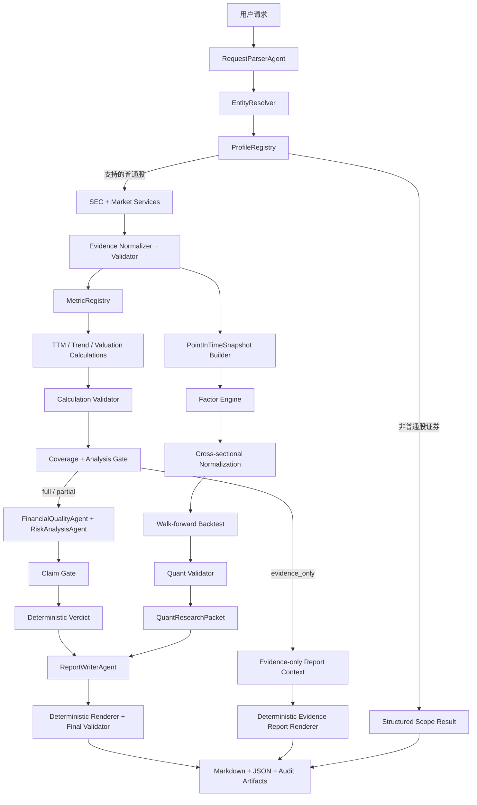
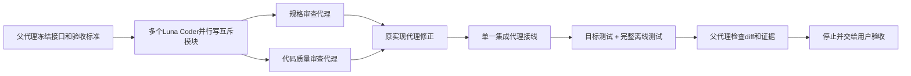
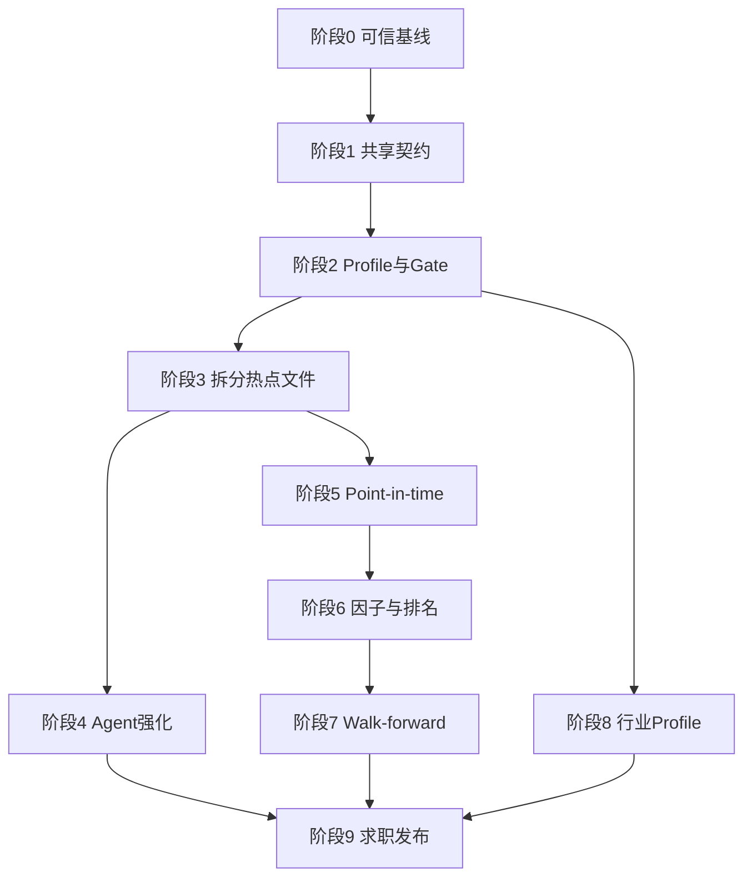

# StockCrewAI 目标架构与多子代理交付规范

## 1. 文档定位

本文档定义 StockCrewAI 从当前“单公司、普通非金融企业、可审计财务研究”原型，演进到“面向美国上市普通股的 Agent 投研平台 + Point-in-time 量化验证层”的目标架构。

项目求职定位固定为：

- 70% Agent / LLM 应用工程；
- 30% 量化研究与验证；
- Agent 负责理解、检索已验证证据、解释和组织语言；
- Python 负责身份、数据选择、财务语义、数学、验证、评分、回测和最终状态；
- 不以增加 Agent 数量作为能力证明；
- 不把回测结果描述为未来收益保证。

本文档同时规定后续 Luna Max 多子代理的任务拆分、文件所有权、依赖顺序、测试门禁和用户检查点。详细到代码步骤的实施计划，应在本文档经用户确认后另行生成。

本文档描述目标状态，不代表当前运行时已经支持全部 Profile。每个阶段只有在代码、离线测试、真实 smoke test 和用户检查均通过后才能被 README 声明为已支持；在此之前继续以 `docs/Expectayion_Projects.md` 的现行 V1 范围为准。

## 2. “任何美股”的工程定义

“任何美股都能生成专业投研报告”不能等价为“任何公司都强制计算 P/E、FCF Yield 和反向 DCF”。专业系统必须先判断公司、证券、会计和数据适用性。

目标覆盖对象为美国交易所上市普通股，包括美国本土发行人、外国私人发行人、ADR、多类别股票和处于特殊生命周期的公司。ETF、共同基金、封闭式基金、期权、债券和加密资产不是普通股，必须返回结构化范围结果，不能套用股票报告。

每次运行必须得到以下四种覆盖状态之一：

| 状态 | 含义 | 允许输出 |
|---|---|---|
| `full` | 核心证据和适用模型完整 | 完整研究报告、确定性结论、全部适用估值 |
| `partial` | 部分模型不适用，但存在足够研究证据 | 专业研究报告、可用指标、明确不适用项 |
| `evidence_only` | 证据足以描述公司和风险，但不足以形成估值结论 | 证据报告，不生成伪造估值或确定性评级 |
| `unsupported_security` | 输入不是受支持的普通股证券 | 结构化范围说明，不生成股票投资报告 |

只有实体无法确认、主来源不可验证或核心 Evidence 冲突时才阻断。单个指标不适用、历史不足、负 EPS 或负 FCF 不得导致整条线路阻断。

## 3. 当前架构基线

当前项目已经具备：

- CrewAI 原生 `Flow`，包含 `@start`、`@listen` 和 `@router`；
- 3 个 Crew、4 个 LLM Agent、4 个 Task；
- EdgarTools SEC 公司、Company Facts、filing 和风险文本；
- yfinance 市场价格与历史价格；
- Decimal 财务计算、TTM、当前估值、历史估值和反向 DCF；
- Evidence、Calculation、Claim、Analysis Gate、Claim Gate 和最终报告验证；
- Markdown 报告、图表、紧凑终端事件、完整 JSON 结果；
- 大量离线单元测试和部分真实公司运行验证。

当前主要结构性问题：

1. `src/stockcrewai/main.py` 同时承担 Flow、阶段业务逻辑、状态投影、报告调用和 CLI，修改冲突面过大。
2. `src/stockcrewai/pipeline_support.py` 同时承担 Crew 适配、脱敏、Claim Gate、估值输入、Verdict 和适用性策略，职责过载。
3. `src/stockcrewai/crews/report/crew.py` 同时承担报告模型、上下文构建、Renderer、最终校验和 Crew 定义，难以并行修改。
4. 指标注册表按“通用企业公式”组织，没有稳定的 Issuer/Security Profile 输入。
5. 当前系统主要回答单家公司“现在怎么样”，还没有跨公司因子比较和历史 walk-forward 证据。
6. Agent 有结构化输出约束，但缺少独立、版本化、可量化的 Agent Eval 发布门禁。

迁移必须采用渐进式提取，不进行一次性重写，不删除现有稳定入口，不在同一任务中同时改架构和业务含义。

## 4. 不可突破的信任边界

### 4.1 LLM 可以做

- 将自然语言请求解析为候选公司、ticker、投资期限和关注方向；
- 通过只读工具查询已验证 Evidence、Calculation 和 filing section；
- 解释已验证财务趋势、因子暴露、风险变化和估值结果；
- 生成只包含叙述结构的 ReportDraft；
- 返回带 Evidence ID 和 Calculation ID 的结构化 Claim。

### 4.2 LLM 不可以做

- 生成或修改 CIK；
- 选择 SEC 核心文件范围；
- 自行决定 XBRL 标签的经济含义；
- 自行执行财务、估值、因子、组合或回测数学；
- 把未验证数字写入 Claim 或报告；
- 决定 Gate、Coverage、Verdict 或回测是否“成功”；
- 把 filing 文本中的指令当成系统指令；
- 在核心线路中自由搜索互联网补齐缺失事实。

### 4.3 Python 必须做

- 确定实体、证券和发行人 Profile；
- 选择数据、期间、单位和 point-in-time 可用日期；
- 生成并验证 Evidence、Calculation、Factor 和 Backtest 结果；
- 应用 Metric Policy、Gate、Verdict 和报告数字渲染；
- 记录版本、来源、时间戳、错误类型和审计链。

## 5. 目标架构

```text
src/stockcrewai/
├── main.py                         # CLI 与兼容入口，不承载业务规则
├── flow.py                         # 唯一 ResearchFlow 编排
├── config.py                       # 环境、模型和运行配置
├── exceptions.py                   # 结构化错误模型
│
├── models/
│   ├── request.py                  # ParsedRequest
│   ├── entity.py                   # EntityRef / SecurityRef
│   ├── profile.py                  # IssuerProfile / SecurityProfile / CoverageResult
│   ├── evidence.py                 # 共享 Evidence 契约
│   ├── calculation.py              # Calculation 契约
│   ├── claim.py                    # Claim 契约
│   ├── verdict.py                  # Verdict 契约
│   └── quant.py                    # PointInTimeSnapshot / Factor / Backtest 契约
│
├── services/
│   ├── sec.py                      # EdgarTools 数据访问和缓存
│   ├── market.py                   # 市场价格、公司行动和历史价格
│   └── evidence_store.py           # 已验证 Evidence 的只读索引
│
├── pipelines/
│   ├── entity_resolution.py        # 确定性实体与证券解析
│   ├── profile_registry.py         # Issuer/Security/Reporting Profile
│   ├── metric_registry.py          # required/optional/not_applicable
│   ├── evidence_pipeline.py        # 规范化和验证
│   ├── ttm_pipeline.py             # TTM 与多期间趋势
│   └── research_gate.py            # Coverage / Analysis / Claim Gate
│
├── calculations/
│   ├── financial.py                # 财务指标纯函数
│   ├── valuation.py                # Profile-aware 当前估值
│   ├── historical.py               # Point-in-time 历史估值
│   └── reverse_dcf.py              # 适用时的反向 DCF
│
├── quant/
│   ├── point_in_time.py            # 历史可用快照
│   ├── factors.py                  # 价值/质量/成长/动量/风险因子
│   ├── normalization.py            # winsorize、行业内排名和 z-score
│   ├── portfolio.py                # 分组、权重、换仓和成本
│   ├── backtest.py                 # walk-forward 引擎
│   └── statistics.py               # 收益、Sharpe、回撤、IC、换手率
│
├── verdict/
│   ├── policy.py                   # 版本化确定性政策
│   └── engine.py                   # Profile/Horizon-aware Verdict
│
├── validators/
│   ├── calculation.py
│   ├── claim.py
│   ├── quant.py
│   └── report.py
│
├── crews/                          # 保持3 Crew、4 Agent
├── tools/                          # CrewAI薄包装；不保存业务规则
├── reporting/                      # Context、Renderer、图表、Artifact Writer
└── evals/                          # Agent、报告、多公司、量化发布评测
```

该目录是目标状态，不要求一次性创建。只有当一个现有职责需要修改时才迁移对应代码；未触碰的稳定代码保留原位。

### 5.1 依赖方向

```text
models
  ↑
services → pipelines → calculations/quant → validators/verdict
  ↑                                      ↓
tools ← crews ← flow → reporting → artifacts
```

约束：

- `quant/` 不得导入 CrewAI 或 `crews/`；
- `calculations/` 不得调用网络；
- `crews/` 不得直接访问 SEC 或 Yahoo；
- `tools/` 只把 Pydantic 输入交给 service/calculation，并返回 Pydantic 输出；
- `flow.py` 只编排和更新 State，不实现公式；
- `main.py` 只保留 `kickoff`、`plot`、`cli` 和兼容入口；
- `pipeline_support.py` 在迁移期作为兼容 facade，调用方清空后再删除，不提前重写。

## 6. 权威运行数据流



ResearchFlow 与 Quant Engine 共享同一套已验证 Evidence 和 Metric Registry。Quant Engine 是纯 Python 消费者，不是新的 Crew，也不新增 Quant Agent。

第一版 `QuantResearchPacket` 只作为报告中的经验证补充研究，不直接改变 Deterministic Verdict。只有未来建立独立、版本化且通过样本外验证的量化 Verdict Policy 后，才可以重新评估这一边界。

## 7. Profile 与指标适用性

### 7.1 三层 Profile

`IssuerProfile` 描述业务和会计模型：

- `standard_operating`；
- `bank`；
- `insurance`；
- `reit`；
- `utility`；
- `commodity_producer`；
- `pre_revenue`；
- `holding_company`。

`SecurityProfile` 描述证券结构：

- `common_stock`；
- `multi_class`；
- `adr`；
- `spac`；
- `recent_listing`；
- `unsupported_fund_security`。

`ReportingProfile` 描述申报制度：

- `domestic_us_gaap`；
- `foreign_private_issuer_ifrs`；
- `investment_company_reporting`。

分类必须优先使用 SEC 的 CIK、SIC、form、taxonomy、ticker/exchange 和证券元数据；只有结构化来源不足时返回 `unknown`，不得让 LLM 猜测。

### 7.2 Metric Policy

每个指标必须具备以下机器字段：

```text
metric_id
profile
applicability = required | optional | not_applicable
required_evidence
formula_id
period_basis
unit_policy
gate_effect = blocking | non_blocking
reason_code
policy_version
```

例如：

- 普通企业的 `free_cash_flow` 可以是 required；
- 银行的普通企业 FCF 和 current ratio 是 not_applicable；
- 负 EPS 公司的 P/E 是 not_applicable；
- 新上市公司的五年历史估值是 not_applicable；
- 多类别股票在股价类别与股数范围不匹配时，市值计算不可用但公司研究仍可继续。

Gate 只读取 Metric Policy 和结构化状态，不解析 warning 文本，不由 Agent 自由决定。

## 8. Agent 工程层

### 8.1 固定 Agent

继续保持：

1. RequestParserAgent；
2. FinancialQualityAgent；
3. RiskAnalysisAgent；
4. ReportWriterAgent。

估值、量化、验证和 Verdict 不增加 Agent。

### 8.2 受限只读工具

为展示真正的 Agent Tool Calling，同时控制风险，可以给 Analysis Crew 增加以下只读工具：

```text
query_validated_evidence(metric_ids, periods, limit)
get_validated_calculations(calculation_ids)
search_validated_filing_sections(query, forms, limit)
get_quant_summary(factor_ids)
```

所有工具只查询当前运行的 allowlist；结果必须包含 ID、来源、时间和验证状态。工具不能联网、不能写状态、不能执行公式、不能扩大证据范围。

### 8.3 Prompt Injection 边界

SEC filing 文本属于不可信数据。传给 Agent 前必须：

- 标记 `content_role=data`；
- 明确禁止执行文本中的指令；
- 限制只返回当前 Task 的 Pydantic schema；
- 对“忽略系统要求”“调用外部工具”“修改评级”等测试样本执行发布门禁；
- 最终仍由 Claim Gate 检查类别、ID、数字和来源。

### 8.4 Agent Eval

| 对象 | 发布指标 |
|---|---|
| RequestParser | 公司/ticker候选、期限、语言和关注方向准确率 |
| FinancialQuality | schema通过率、Claim接受率、Evidence覆盖率、数字幻觉率 |
| RiskAnalysis | 风险章节召回率、无来源风险率、事件状态准确率 |
| ReportWriter | 章节覆盖、数字一致率、禁止建议命中率、Claim新增率 |
| 全流程 | 成功率、重试次数、延迟、token、成本、确定性结果一致率 |

最低发布门槛：

- 报告数字 Evidence 覆盖率 100%；
- 可用 Calculation 复算通过率 100%；
- rejected Claim 进入报告数量为 0；
- 同一离线 fixture 连续运行 5 次，确定性数字、Gate、Verdict 和 artifact hash 完全一致；
- Agent schema 通过率不低于 95%；
- Prompt injection fixture 绕过率为 0。

## 9. 量化验证层

### 9.1 目的

量化层不负责预测单只股票明日价格，而是回答：如果历史上持续按照同一套质量、价值、成长、动量和风险规则选择股票，是否得到稳定、可解释且扣除成本后仍有意义的结果。

### 9.2 Point-in-time 契约

`PointInTimeSnapshot` 至少包含：

```text
snapshot_id
as_of
cik
ticker
issuer_profile
security_profile
filing_cutoff
available_evidence_ids
available_calculation_ids
financial_features
market_features
data_quality
```

硬规则：

- `filed_at <= as_of`；
- 价格只能使用 `timestamp <= as_of`；
- 拆股和股息必须使用一致复权口径；
- 不允许最新财务值倒填历史；
- 每个 snapshot 保存来源 ID 和构建版本；
- 数据缺失使用 typed unavailable，不填 0、不前视填充。

### 9.3 第一版因子

价值：

- Earnings Yield；
- FCF Yield；
- P/B（仅适用 Profile）；
- EV/EBITDA（证据完整时）。

质量：

- ROE；
- ROIC；
- Operating Margin；
- FCF Margin；
- Cash Conversion；
- Debt/Equity。

成长：

- 3 年 Revenue CAGR；
- EPS Growth；
- FCF Growth。

市场与风险：

- 12 个月动量，跳过最近 1 个月；
- 12 个月波动率；
- Beta；
- 最大回撤。

第一版不使用机器学习，不做分钟级交易，不做期权，不优化到得到漂亮历史曲线为止。

### 9.4 标准化与行业比较

每个 rebalance date：

1. 按当时可用 Profile 和行业分组；
2. 对原始因子执行固定分位 winsorize；
3. 在行业内转换为 percentile 或 z-score；
4. 按版本化权重形成综合分数；
5. 保存原始值、标准化值、行业样本数和公式版本。

行业样本不足时返回 `insufficient_peer_sample`，不与经济含义不同的行业强行比较。

### 9.5 第一版回测协议

- 股票池：50～100 只流动性较好的美国普通股；
- 历史区间：至少 5 年；
- 频率：月度再平衡；
- 信号：Quality + Value + Momentum；
- 组合：综合评分前 20% 等权；
- 基准：SPY 和同股票池等权组合；
- 成本：固定双边交易成本并执行敏感性分析；
- 输出：年化收益、波动率、Sharpe、最大回撤、超额收益、IC、换手率和分位数组合收益。

当前免费数据难以彻底消除幸存者偏差。第一版必须把固定现存股票池标记为 `survivorship_bias_known`，只能作为工程和方法验证，不能宣称发现可交易 Alpha。达到正式量化研究标准前，需要历史成分股和退市证券数据。

### 9.6 数值边界

- 财务金额、会计比率、估值和 Evidence 中间值继续使用 Decimal；
- 大规模收益序列、相关性和标准化统计可以在验证边界后转换为 float64；
- 转换必须记录来源、容差和统计版本，不能把 float 结果回写成原始财务 Evidence；
- 引入 pandas/numpy 作为直接生产依赖前，必须单独向用户报告原因、兼容性和无新增依赖方案。

## 10. 从当前项目到目标项目的迁移阶段

每个阶段结束后停止，由用户检查产物和测试结果；未经确认不进入下一阶段。

### 阶段 0：建立可信基线

目标：当前主分支对普通企业稳定，所有已知失败都有根因和固定测试。

工作包：

- 固化完整离线测试基线；
- 禁止 Report Guardrail 隐式 fallback；
- 修复报告建议正则误判和 Profile 输入未传递；
- 固化 30 家公司的 live smoke runner，但 live 结果不进入默认测试；
- 输出每家公司最终阶段、Profile、Gate、报告状态和失败原因。

验收：默认测试全绿；TSLA 类业务文本不再误判为卖出建议；不适用反向 DCF 不再阻断；真实外部错误仍明确失败。

### 阶段 1：冻结共享契约

目标：先定义 Profile、Coverage、Metric Policy 和 Quant 契约，减少后续并行冲突。

工作包：

- 创建共享 Pydantic 契约和 schema 测试；
- 定义稳定 reason codes；
- 定义 ResearchFlowState 只保存 JSON-safe 公共状态；
- 保持旧字段兼容，不改变运行行为。

验收：仅契约变化，完整回归结果与阶段 0 一致。

### 阶段 2：Profile Registry 与 Gate 对齐

目标：把“某指标缺失”与“该指标不适用”彻底分开。

工作包：

- 确定性 Issuer/Security/Reporting 分类；
- Profile-aware Metric Registry；
- Analysis Gate、Valuation 和 Verdict 使用同一个 Policy；
- 报告展示 Coverage 和不适用原因；
- 第一批支持 `standard_operating`、`pre_revenue`、`multi_class` 和 `recent_listing`。

验收：普通企业、负 FCF、负 EPS、多类别股票和新上市公司均有正确 typed outcome，不因无意义指标阻断。

### 阶段 3：拆分共享热点文件

目标：为多子代理并行开发创造稳定文件边界，不进行业务重写。

工作包：

- 将 Flow 从 `main.py` 提取到 `flow.py`；
- 将 Claim/Gate/Profile 纯函数从 `pipeline_support.py` 提取到 `pipelines/` 和 `validators/`；
- 将报告 Context、Renderer、Validator 从 `report/crew.py` 提取到 `reporting/`；
- 保留原模块 re-export 兼容层；
- 用零行为变化测试证明迁移。

验收：公共入口和报告产物不变；`main.py`、`pipeline_support.py` 和 Report Crew 不再是所有功能的共同写入点。

### 阶段 4：Agent 工程强化

目标：让项目体现安全工具调用、结构化契约、评测和可观测性。

工作包：

- 已验证 Evidence 只读查询工具；
- Prompt 和 schema 版本；
- Prompt injection fixtures；
- Agent Eval runner；
- token、成本、延迟、重试和失败分类；
- 继续保持 3 Crew、4 Agent。

验收：Agent Eval 满足第 8.4 节门槛；工具无法越过当前 allowlist。

### 阶段 5：Point-in-time 数据集

目标：把当前 SEC Evidence 转换成可复现历史 snapshot。

工作包：

- 按 `as_of` 选择 filing 和价格；
- 构造季度/月度 snapshot；
- 保存数据质量和缺失原因；
- 增加未来数据泄漏、修订、拆股和跨期测试；
- snapshot 缓存在项目运行目录或明确配置目录，不写入无关用户目录。

验收：任何 snapshot 都能列出当时可用的 Evidence；未来 filing 无法进入过去状态。

### 阶段 6：因子、标准化和排名

目标：形成透明、版本化、可解释的横截面因子分数。

工作包：

- 第一版因子公式；
- Profile applicability；
- 行业内 winsorize 和排名；
- FactorObservation 验证；
- QuantResearchPacket 输出。

验收：同一 snapshot 集合重复运行得到完全一致的因子值和排名。

### 阶段 7：Walk-forward 回测

目标：用严格时间顺序验证因子，而不是制造漂亮回测。

工作包：

- 月度 rebalance；
- 组合权重和交易成本；
- SPY/等权基准；
- Sharpe、回撤、IC、换手率；
- 幸存者偏差和数据覆盖声明；
- 离线小型 golden backtest fixture。

验收：无 look-ahead；费用变化能影响结果；所有统计可用第二实现或 golden fixture 复核。

### 阶段 8：行业 Profile 扩展

目标：逐类扩展专业报告，不以全局公式硬套所有行业。

优先顺序：

1. REIT；
2. 银行；
3. 保险；
4. 公用事业；
5. 商品生产商；
6. ADR / 20-F / IFRS；
7. 控股公司和 SPAC。

每个 Profile 都必须独立提交 Metric Policy、fixture、Gate 测试、报告样例和量化适用性。一个 Profile 未通过验收时不影响已发布 Profile。

### 阶段 9：求职发布版

目标：把工程能力变成面试官五分钟内可验证的产物。

工作包：

- GitHub Actions 离线测试；
- 三份代表性正式报告；
- 一份量化研究报告；
- 30～50 家公司覆盖矩阵；
- 架构图、数据契约、错误模型和复现命令；
- 2～3 分钟演示视频脚本；
- 简历项目描述和面试问题清单。

验收：新用户根据 README 可在五分钟内理解项目，在配置合法环境后运行一个示例，并能看到失败也具有结构化解释。

## 11. 多 Luna 子代理开发架构

### 11.1 角色

| 角色 | 模型/模式 | 职责 |
|---|---|---|
| 父代理 | 当前主模型 | 架构、接口冻结、任务 Prompt、关键取舍、集成验收、用户沟通 |
| 实现代理 | `luna_coder` / Luna Max | 在独占文件范围内执行 TDD 实现或修复 |
| 调研/审查代理 | `luna_worker` / Luna Max | 只读探索、规格审查、测试审查、量化方法审查 |
| 集成代理 | 单个 `luna_coder` / Luna Max | 只在所有子工作包通过后修改共享入口和接线 |

当 Luna Max 运行时不可用或线程配额已满时，必须报告阻塞；不得静默替换成其他模型。

### 11.2 最高效率并发度

推荐每个检查点最多同时运行：

- 3 个实现代理；
- 2 个只读审查代理；
- 1 个父代理负责关键路径与集成。

超过这个并发度时，接口沟通、合并冲突和重复测试的成本通常高于编码收益。涉及 `main.py`、`pipeline_support.py`、`report/crew.py` 的迁移阶段，只允许一个集成代理写这些文件。

### 11.3 文件所有权规则

| 工作域 | 独占写入范围 | 禁止同时写入 |
|---|---|---|
| Contracts | `models/`、对应 `tests/test_*_models.py` | Flow、Crew、Renderer |
| Profiles | `pipelines/profile_registry.py`、`pipelines/metric_registry.py`、Profile fixtures | `main.py`、Report Crew |
| Agent tools | 新只读工具、对应测试 | Evidence生成、Verdict |
| Agent prompts | 单个 Crew 的 YAML、crew.py、对应配置测试 | 其他 Crew、Flow |
| Quant snapshot | `quant/point_in_time.py`、对应测试 | 因子、回测、Crew |
| Quant factors | `quant/factors.py`、`quant/normalization.py`、对应测试 | snapshot、Flow |
| Quant backtest | `quant/portfolio.py`、`quant/backtest.py`、`quant/statistics.py` | ResearchFlow、Crew |
| Reporting | `reporting/`、报告和图表测试 | Quant数学、Profile分类 |
| Integration | `main.py`、`flow.py`、`pipeline_support.py`、公共入口测试 | 所有其他代理停止共享文件修改 |

任何代理发现必须修改所有权之外的文件时停止并上报，不自行扩大范围。

### 11.4 每个检查点的执行顺序



不得在前一检查点未被用户确认时启动下一阶段。

### 11.5 实现子代理 Prompt 模板

```text
你是 StockCrewAI 的 Luna Max 实现子代理。你不是唯一在仓库工作的代理，
不得回退或覆盖其他人的修改。

目标：<单一可测试目标>
独占写入文件：<精确路径>
只读依赖：<精确路径>
禁止修改：main.py、pipeline_support.py 及所有未授权路径。

先完整阅读 AGENTS.md、docs/Expectayion_Projects.md、docs/architecture.md
和与本任务直接相关的源码、测试。遵守当前 CrewAI 版本要求。
使用 superpowers:using-superpowers、test-driven-development、
systematic-debugging、verification-before-completion 和 ponytail。

执行 RED → GREEN → REFACTOR；不调用真实 SEC、Yahoo 或付费 LLM；
不新增依赖；不增加 Agent；不实现 fallback；保留 Evidence 和 Decimal 契约。

完成时返回：根因/设计、修改文件、测试命令、完整结果、剩余风险。
如果任务需要修改所有权之外的文件，立即停止并报告接口缺口。
```

### 11.6 审查子代理 Prompt 模板

```text
你是只读 Luna Max 审查代理，不修改任何文件。
对照 docs/architecture.md 和当前任务验收标准审查指定 diff。

规格审查重点：功能是否完整、是否越权、是否破坏信任边界。
质量审查重点：根因、测试、错误模型、类型、可维护性和过度设计。

按严重度输出 findings，包含精确文件和行号。没有发现时明确写“无阻断项”。
不要用风格偏好代替正确性问题。
```

## 12. 依赖 DAG 与并行窗口



最高效的并行窗口只有两个：

1. 阶段 3 完成后，Agent Eval 与 Point-in-time 数据集可以并行；
2. Profile Registry 接口冻结后，不同行业 Profile 可以分别实现，但共享 Registry 聚合由单一集成代理完成。

阶段 0～3 属于关键路径，必须以串行为主。过早并行只会让多个代理同时修改巨型共享文件。

## 13. 测试与发布门禁

### 13.1 默认离线测试

- 不访问 DeepSeek、SEC、Yahoo 或其他实时服务；
- 固定时间、价格、filing 和模型输出；
- 所有错误都有稳定 reason code；
- 财务和估值使用 Decimal；
- 每个复杂公式至少有独立复算或 golden result；
- 每个 Profile 至少有一个完整 fixture 和一个缺失数据 fixture。

### 13.2 Live smoke test

- 显式命令启动；
- 真实公司并发数受 SEC/Yahoo/DeepSeek限制；
- 同一外部服务的测试串行或有界并发；
- 结果写入临时目录，不覆盖正式报告；
- 外部网络失败与代码回归分开统计。

### 13.3 每个工作包的最小完成定义

1. 失败测试能够证明问题或新契约；
2. 最小实现使目标测试通过；
3. 相关回归通过；
4. `git diff --check` 通过；
5. 没有修改未授权文件；
6. 没有 fallback、伪造数据或未验证 ID；
7. 有单独 commit；
8. 父代理完成 diff 审查；
9. 停止并等待用户检查。

## 14. 最高开发效率结论

本项目最高效率的开发架构不是“父代理少做思考、尽可能多开子代理”，而是：

1. 父代理只负责架构、接口、任务边界、关键诊断和最终验收；
2. Luna Coder Max 负责所有常规实现、修改和修复；
3. 先冻结 Pydantic 契约和 reason codes；
4. 先拆除 `main.py`、`pipeline_support.py`、Report Crew 三个共享热点，再扩大并行；
5. 每个实现代理拥有互斥文件集合；
6. 每个工作包先测试、后实现、独立提交；
7. 规格审查与质量审查分离；
8. 单一集成代理负责公共入口接线；
9. 每个检查点运行目标测试和完整离线测试；
10. 每完成一个用户可验证的任务就停止，不跨阶段连续堆改动。

这套方式比五个代理同时修改一条 Flow 更快，也更容易定位错误。量化层与 Agent 层共享 Evidence，但代码和测试互不依赖 CrewAI，因此是最适合并行开发的第二条工作流。

## 15. 明确非目标

当前路线不包含：

- 增加 Planner、Manager、Validator 或 Quant LLM Agent；
- 高频交易和分钟级数据；
- 期权、债券、ETF或加密资产分析；
- 自动下单；
- 为得到高 Sharpe 反复调参；
- 个性化买入、卖出或仓位建议；
- 用 LLM 代替行业会计政策；
- 在第一版量化层引入机器学习；
- 一次性重写当前全部源码。

上述能力只有在当前发布门禁稳定、用户明确扩大范围并重新设计后才进入后续版本。
