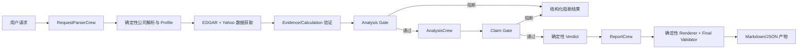

# StockCrewAI 当前架构

本文档只描述当前可运行的单公司基本面研究主流程。选股、回测和相关旁证已经从生产线路中移除，不属于本项目当前职责。

## 1. 目标与边界

项目把自然语言研究请求转换为一份有来源、可复核的研究报告。LLM 只负责解析请求、解释已验证事实和组织叙述；Python 负责来源选择、数字计算、验证、门禁、路由和最终报告数字。

当前不承诺所有证券都有相同指标，也不把缺失数据填成零。Profile 判断某项指标不适用时返回 `not_applicable`；需要但没有可靠证据时返回 `unavailable`，必需数据缺失则阻断正式报告。

## 2. 目录职责

```text
src/stockcrewai/
├── main.py                  # CLI/脚本入口、运行产物写出、Flow plot
├── flow.py                  # @start/@listen/@router 主编排与状态
├── crews/                   # 三个 Crew 的 Agent/Task 配置
├── tools/                   # EDGAR、行情、计算、验证和估值工具
├── services/                # 公司解析、证据存储、运行指标
├── pipelines/               # 证据、Profile、指标、估值、分析流水线
├── profiles/                # standard_operating Profile 与特殊类别分类/阻断规则
├── validators/              # Analysis Gate、Claim Gate
├── reporting/               # 报告上下文、确定性 Renderer、图表和最终验证
└── models/                  # Request、Evidence、Policy、Profile 等共享模型
```

## 3. 主流程



Flow 是跨 Crew 传输的唯一总线。每个节点把结果写入 `ResearchFlowState`，下一个 `@listen` 方法通过 `self.state` 或显式参数读取；Crew 不直接修改下游 Crew 的输入。

## 4. Crew 与 Agent

| Crew | Agent | 输入 | 输出 |
| --- | --- | --- |
| `RequestParserCrew` | `RequestParserAgent` | 原始自然语言请求 | 结构化公司候选、ticker、语言、期限和关注点 |
| `AnalysisCrew` | `FinancialQualityAgent` | 已验证财务 Evidence/Calculation | 财务 Claim JSON，只引用已有 ID |
| `AnalysisCrew` | `RiskAnalysisAgent` | 已验证 SEC 风险章节 | 风险 Claim JSON，只引用已有 Evidence ID |
| `ReportCrew` | `ReportWriterAgent` | Gate 通过后的 Claim、确定性指标和模板字段 | 叙述草稿，不新增事实数字 |

估值、计算、验证、Gate、Verdict 和报告数字不交给 LLM 决定。`flow.py` 中的 `@router` 根据 Python 返回的结构化状态选择继续或阻断。

## 5. 可信数据边界

- `EvidenceRecord`：来源、申报日期、期间、单位、币种、原始值和验证状态。
- `CalculationRecord`：固定公式、输入 Evidence ID、结果、期间和验证状态。
- `ClaimRecord`：Agent 对上述记录的文字解释，不是事实来源。
- `PolicyDecision`：某个指标是否可用、是否适用、是否阻断。
- `GateResult`：当前阶段是否能继续及稳定 `reason_code`。

Renderer 只读取已验证的上下文。缺少来源、期间冲突、币种冲突、无效价格或未验证 ID 都不能被叙述性 Agent 补齐。

## 6. 运行入口

```bash
uv run --no-sync crewai run
uv run --no-sync crewai flow plot
uv run --no-sync pytest -q
```

`crewai flow kickoff` 是 CrewAI 的兼容别名，若 CLI 提示 deprecated，使用 `crewai run`。运行成功时通常生成 `run-output.md`、`run-result.json` 和 `investment-report.md`；阻断时不覆盖已有正式报告。
