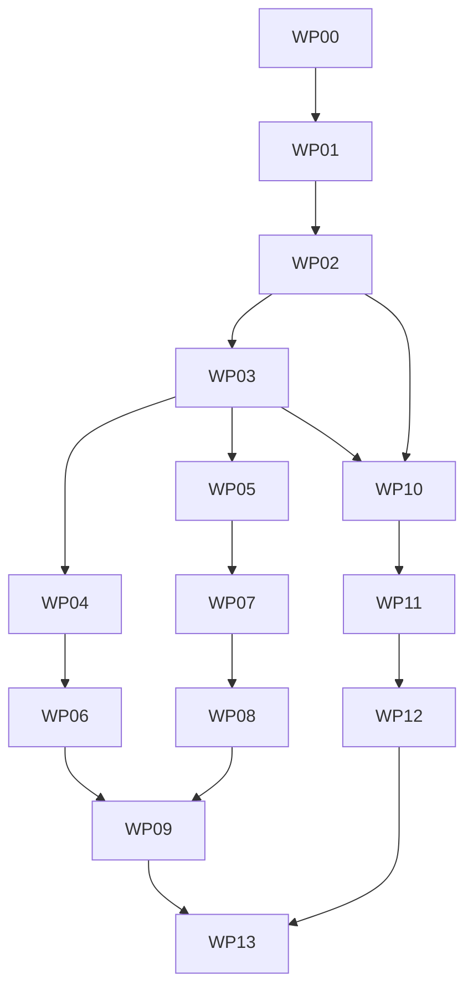

# StockCrewAI Agent + Quant 目标实施计划

> **执行要求：** 实现代理必须使用 `superpowers:subagent-driven-development` 执行本计划；每个工作包开始前使用 `superpowers:test-driven-development`，遇到失败使用 `superpowers:systematic-debugging`，交付前使用 `superpowers:verification-before-completion`。

**目标：** 将当前仅对普通美国经营企业较稳定的研究 Flow，演进为“固定 3 个 Crew、4 个 LLM Agent + 确定性研究/量化内核”的专业美股投研项目；按证券和行业 Profile 输出 `full`、`partial`、`evidence_only` 或 `unsupported_security` 覆盖结果，并提供 point-in-time、可复现的因子和回测证据。

**架构：** CrewAI Flow 只编排事件和分支；LLM Agent 只负责请求解析、已验证事实解释、风险解释和报告叙事；Python 服务负责公司识别、SEC/行情选择、Profile、公式、Claim Gate、Verdict、point-in-time、因子和回测。共享 Pydantic 契约先冻结，巨型共享文件随后拆分，最后并行建设 Agent Eval、量化链路和行业 Profile。

**技术栈：** Python 3.10–3.13、CrewAI 1.15.x、Pydantic、edgartools、yfinance、matplotlib、SQLite（CrewAI Flow 持久化）、标准库 `decimal` / `statistics` / `unittest`。第一版不新增 pandas、numpy、数据库 ORM 或 Web 框架。

---

## 1. 执行清单（机器可读）

```yaml
schema_version: "1.0"
plan_id: stockcrewai-agent-quant-v1
source_architecture: docs/architecture.md
execution_mode: subagent_driven
package_manager: uv
run_prefix: UV_CACHE_DIR=/private/tmp/stockcrewai-uv-cache uv run --no-sync
implementation_agent: luna_coder
implementation_model: Luna Max
review_agent: luna_worker
review_model: Luna Max
checkpoint_policy: stop_after_each_work_package_for_user_review
max_parallel_implementers: 3
max_parallel_reviewers: 2
shared_file_integrator_count: 1
live_network_in_default_tests: false
fallback_allowed: false
new_llm_agents_allowed: false
new_dependencies_allowed_without_approval: false
work_packages:
  - {id: WP00, depends_on: [], title: 可信基线与版本门禁}
  - {id: WP01, depends_on: [WP00], title: 共享领域契约}
  - {id: WP02, depends_on: [WP01], title: Profile Registry 与 Metric Policy}
  - {id: WP03, depends_on: [WP02], title: 共享热点文件拆分}
  - {id: WP04, depends_on: [WP03], title: Agent 工具与安全契约}
  - {id: WP05, depends_on: [WP03], title: Point-in-time Snapshot}
  - {id: WP06, depends_on: [WP04], title: Agent Eval 与运行观测}
  - {id: WP07, depends_on: [WP05], title: 因子计算与行业标准化}
  - {id: WP08, depends_on: [WP07], title: Walk-forward 回测}
  - {id: WP09, depends_on: [WP06, WP08], title: QuantResearchPacket 报告接入}
  - {id: WP10, depends_on: [WP02, WP03], title: REIT Profile}
  - {id: WP11, depends_on: [WP10], title: 银行与保险 Profile}
  - {id: WP12, depends_on: [WP11], title: 其他行业与证券结构 Profile}
  - {id: WP13, depends_on: [WP09, WP12], title: 求职发布版}
```

依赖图：



## 2. 全局不可违反规则

### 2.1 信任边界

1. LLM 不选择 SEC filing、不解析最终 CIK、不计算财务指标、不决定 Gate 或 Verdict。
2. 所有进入报告的数字必须引用一个已验证 `evidence_id` 或 `calculation_id`。
3. 所有财务金额和会计比率使用 `Decimal`；只在统计边界将收益序列转换为 `float`。
4. 不得把缺失值写成 0，不得用最新值回填历史，不得用 Agent 猜测 Profile。
5. `not_applicable` 不是错误；只有 Policy 标记为 `required + blocking` 的指标缺失或验证失败才可阻断正式报告。
6. `QuantResearchPacket` 第一版只作为报告旁证，不改变 Deterministic Verdict。
7. 禁止 fallback：真实外部依赖失败必须返回 typed error 和稳定 reason code，不伪造数据、不静默降级。

### 2.2 Crew 和 Agent 数量

固定以下结构，不得增加 Agent：

| Crew | Agent | 输入 | 输出 |
|---|---|---|---|
| Request Parser Crew | RequestParserAgent | 原始中文/英文请求 | `ParsedResearchRequest` |
| Analysis Crew | FinancialQualityAgent | 已验证 Evidence、Calculation、Profile、Policy | `AnalysisClaims` 中的财务质量 Claim |
| Analysis Crew | RiskAnalysisAgent | 已验证 filing section、事件、Profile | `AnalysisClaims` 中的风险 Claim |
| Report Crew | ReportWriterAgent | `ReportContext`，只含 accepted Claims 和确定性结果 | `ReportDraft` 叙事字段 |

估值、验证、量化、Gate 和 Verdict 都是 Python 模块，不创建 `ValuationAgent`、`QuantAgent` 或 `ValidatorAgent`。

### 2.3 环境和命令

所有 Python 命令都使用：

```bash
UV_CACHE_DIR=/private/tmp/stockcrewai-uv-cache uv run --no-sync python -m unittest discover -s tests -p 'test_*.py' -v
```

禁止执行：

- `uv sync`；
- 创建或替换 `.venv`；
- 未经用户批准的 `uv add`、依赖升级或锁文件批量改写；
- 默认测试中的真实 DeepSeek、SEC、Yahoo 请求；
- 删除用户已有报告、fixture、运行输出或未提交修改。

### 2.4 CrewAI 写码前置门禁

任何会修改 Flow、Crew、Agent、Task 或 Tool 的工作包，开始时必须重新执行并记录：

```bash
UV_CACHE_DIR=/private/tmp/stockcrewai-uv-cache uv run --no-sync python -c "import crewai; print(crewai.__version__)"
```

同时读取：

- `https://pypi.org/pypi/crewai/json`；
- `https://docs.crewai.com/en/changelog`；
- 与工作包相关的官方 `concepts/flows`、`concepts/agents`、`concepts/tasks` 或 `concepts/tools` 页面。

本计划编写时安装版为 **1.15.11**，官方最新文档为 **1.15.14**。本计划不授权升级；若实施时版本变化，代理必须报告差异并等待用户决定。

### 2.5 每个工作包的统一完成定义

每个工作包必须依次满足：

1. 读取 `AGENTS.md`、`docs/Expectayion_Projects.md`、`docs/architecture.md`、本文件及任务相关代码和测试；
2. 先写能证明需求的失败测试；
3. 运行目标测试并记录 RED 证据；
4. 写最小实现；
5. 目标测试通过；
6. 相关回归和完整离线测试通过；
7. `compileall` 和 `git diff --check` 通过；
8. 实现代理没有修改独占范围之外的文件；
9. 只读规格审查和质量审查均无阻断项；
10. 单一集成代理完成共享入口接线；
11. 形成独立 commit；
12. 父代理停止，向用户展示 diff、命令、结果和剩余风险，等待批准后才进入下一工作包。

完整离线门禁命令：

```bash
UV_CACHE_DIR=/private/tmp/stockcrewai-uv-cache uv run --no-sync python -m unittest discover -s tests -p 'test_*.py' -v
UV_CACHE_DIR=/private/tmp/stockcrewai-uv-cache uv run --no-sync python -m compileall -q src tests
git diff --check
```

---

## 3. 目标目录与模块边界

最终目录使用以下最小结构；没有实际职责的空目录不得创建：

```text
src/stockcrewai/
├── main.py                         # CLI、kickoff、plot；不含业务算法
├── flow.py                         # ResearchFlow、@start/@listen/@router、结构化状态
├── models/
│   ├── request.py                  # ParsedResearchRequest
│   ├── evidence.py                 # Evidence、Calculation、Claim
│   ├── profile.py                  # 三层 Profile、Coverage、ProfileResult
│   ├── policy.py                   # MetricPolicy、PolicyDecision、GateResult
│   └── quant.py                    # Snapshot、Factor、Backtest、Quant packet
├── services/
│   ├── company_resolver.py         # 公司名/ticker/CIK 的确定性解析
│   ├── evidence_store.py           # 当前运行已验证对象的只读索引
│   ├── market_data.py              # 行情记录规范化与验证边界
│   └── runtime_metrics.py          # 延迟、token、重试、失败分类
├── pipelines/
│   ├── evidence_pipeline.py        # SEC/TTM/行情编排
│   ├── profile_registry.py         # 确定性 Profile 分类
│   ├── metric_registry.py          # Profile-aware 指标适用性
│   ├── analysis_pipeline.py        # Analysis Crew 输入与 accepted Claim 汇总
│   └── valuation_pipeline.py       # 估值输入和确定性结果汇总
├── calculations/
│   ├── financial.py                # 通用财务公式
│   └── valuation.py                # 当前估值、历史估值、反向 DCF 公式
├── validators/
│   ├── claim_gate.py               # Claim schema/ID/数字/类别验证
│   ├── analysis_gate.py            # Metric Policy 驱动的分析门禁
│   └── report_gate.py              # 最终报告确定性验证
├── quant/
│   ├── dataset.py                  # 固定股票池数据集构建和命令行入口
│   ├── point_in_time.py            # 无前视 Snapshot
│   ├── factors.py                  # 版本化因子公式
│   ├── normalization.py            # winsorize、z-score、percentile
│   ├── portfolio.py                # 调仓、权重、交易成本
│   ├── backtest.py                 # walk-forward 主流程
│   ├── statistics.py               # CAGR、波动率、Sharpe、回撤、IC
│   └── packet.py                   # QuantResearchPacket 构建
├── profiles/
│   ├── reit.py                     # REIT 指标和适用性
│   ├── bank.py                     # 银行指标和适用性
│   ├── insurance.py                # 保险指标和适用性
│   ├── utility.py                  # 公用事业指标和适用性
│   ├── commodity_producer.py       # 商品生产商指标和适用性
│   ├── foreign_issuer.py           # ADR、20-F、IFRS 映射
│   ├── holding_company.py          # 控股公司指标和适用性
│   └── spac.py                     # SPAC 证券结构和适用性
├── reporting/
│   ├── context.py                  # canonical ReportContext
│   ├── renderer.py                 # Markdown 确定性拼装
│   ├── validator.py                # 报告数字和禁用内容检查
│   └── visuals.py                  # 三张临时图及自适应布局
├── crews/                          # 固定 3 Crew / 4 Agent
├── tools/                          # BaseTool 薄适配器，不放业务逻辑
└── evals/
    ├── agent_eval.py               # 离线 Agent 输出评测
    └── live_smoke.py               # 显式启动的真实网络冒烟
```

`pipeline_support.py` 在迁移期仅保留兼容 re-export，所有调用迁移完成后再由单独清理任务删除；不得在 WP03 一次性删除。

---

## 4. 核心数据契约

WP01 必须实现以下语义，不得由后续代理各自定义近似版本。

### 4.1 公司身份

`CompanyIdentity` 必须包含：

```text
company_name
ticker
cik
exchange
security_type
source_reference
status = resolved | ambiguous | unsupported | unavailable
reason_code
```

RequestParserAgent 只产生候选值；`services/company_resolver.py` 使用 SEC ticker/CIK 映射和证券元数据确定最终身份。候选冲突或多证券类别无法唯一确定时返回 typed status，不能选择置信度最高的 LLM 猜测。

### 4.2 Profile 与 Coverage

```python
class IssuerProfile(str, Enum):
    STANDARD_OPERATING = "standard_operating"
    BANK = "bank"
    INSURANCE = "insurance"
    REIT = "reit"
    UTILITY = "utility"
    COMMODITY_PRODUCER = "commodity_producer"
    PRE_REVENUE = "pre_revenue"
    HOLDING_COMPANY = "holding_company"
    UNKNOWN = "unknown"

class SecurityProfile(str, Enum):
    COMMON_STOCK = "common_stock"
    MULTI_CLASS = "multi_class"
    ADR = "adr"
    SPAC = "spac"
    RECENT_LISTING = "recent_listing"
    UNSUPPORTED_FUND_SECURITY = "unsupported_fund_security"
    UNKNOWN = "unknown"

class ReportingProfile(str, Enum):
    DOMESTIC_US_GAAP = "domestic_us_gaap"
    FOREIGN_PRIVATE_ISSUER_IFRS = "foreign_private_issuer_ifrs"
    INVESTMENT_COMPANY_REPORTING = "investment_company_reporting"
    UNKNOWN = "unknown"

class CoverageLevel(str, Enum):
    FULL = "full"
    PARTIAL = "partial"
    EVIDENCE_ONLY = "evidence_only"
    UNSUPPORTED_SECURITY = "unsupported_security"
```

`ProfileResult` 必须包含：

```text
issuer_profile
security_profile
reporting_profile
coverage_level
classification_evidence_ids
reason_codes
registry_version
```

### 4.3 Metric Policy

```python
class Applicability(str, Enum):
    REQUIRED = "required"
    OPTIONAL = "optional"
    NOT_APPLICABLE = "not_applicable"

class GateEffect(str, Enum):
    BLOCKING = "blocking"
    NON_BLOCKING = "non_blocking"
```

`MetricPolicy` 必须包含：

```text
metric_id
issuer_profile
security_profile
reporting_profile
applicability
required_evidence
formula_id
period_basis
unit_policy
gate_effect
reason_code
policy_version
```

`PolicyDecision` 必须包含：

```text
metric_id
status = available | unavailable | not_applicable | invalid
evidence_ids
calculation_ids
reason_code
blocking
```

Gate 只能读取 `list[PolicyDecision]`，不得解析 warning、limitations 或 Agent 自然语言。

`GateResult` 必须包含：

```text
status = ready | blocked | evidence_only | unsupported
coverage_level
blocking_decisions
non_blocking_decisions
reason_codes
policy_version
```

### 4.4 市场价格

`MarketPriceRecord` 必须包含：

```text
ticker
price
currency
price_timestamp
source_reference
adjustment_basis = raw | split_adjusted | total_return_adjusted
validation_status
```

`price` 使用 `Decimal`；`price_timestamp` 必须带时区；缺少价格、时间、币种或来源时不能构造 validated record。

### 4.5 Quant

`PointInTimeSnapshot`：

```text
snapshot_id
as_of
cik
ticker
issuer_profile
security_profile
reporting_profile
filing_cutoff
price_cutoff
available_evidence_ids
available_calculation_ids
financial_features
market_features
data_quality
builder_version
```

`FactorObservation`：

```text
factor_id
formula_version
snapshot_id
as_of
ticker
raw_value
normalized_value
peer_group
peer_count
evidence_ids
calculation_ids
status
reason_code
```

`QuantResearchPacket`：

```text
as_of
universe_id
strategy_version
coverage
factor_summary
ranking_summary
backtest_summary
benchmark_summary
data_quality
limitations
artifact_ids
```

`UniverseManifest`：

```text
universe_id
tickers
selection_as_of
membership_source
membership_basis
known_biases
manifest_version
```

第一版固定现存股票池的 `known_biases` 必须包含 `survivorship_bias_known`。

---

## 5. 工作包详细规格

## WP00 — 可信基线与版本门禁

**目标：** 固定当前行为，修复已知确定性误阻断，不引入新架构行为。

**执行方式：** 1 个 `luna_coder` 实现；2 个 `luna_worker` 分别做失败分类和测试审查；本工作包不并行修改共享源文件。

**独占写入：**

- `tests/test_baseline_contract.py`（新建）；
- `tests/fixtures/baseline/`（新建，纯离线 JSON）；
- `src/stockcrewai/main.py`（单一实现代理，仅限 Profile 传递）；
- `src/stockcrewai/pipeline_support.py`（同一实现代理，仅限 Gate 根因）；
- `src/stockcrewai/crews/report/crew.py`（同一实现代理，仅限建议文本误判）；
- `src/stockcrewai/evals/live_smoke.py`（新建显式 live runner）；
- `tests/test_live_smoke_cli.py`（新建，只测 CLI 和 mock，不联网）；
- `docs/baseline-status.md`（新建）；
- `docs/data-contracts.md`（新建，先记录当前契约，WP01 再冻结目标契约）；
- `docs/numeric-conventions.md`（新建）；
- `docs/error-model.md`（新建）；
- `docs/testing-strategy.md`（新建）。

**禁止：** 新增依赖、Profile 扩展、量化代码、fallback、真实网络进入默认测试。

**步骤：**

1. 在修改任何业务源码前，创建四份基础规范：当前/目标数据契约、Decimal 与统计转换边界、稳定 reason code 错误模型、默认离线与显式 live 测试边界。当前仓库尚无这四个文件，因此这是 WP00 的第一个子任务。
2. 记录 CrewAI 安装版本、官方最新版本和相关 changelog；不升级。
3. 运行完整离线测试并把测试数、失败数、耗时写入 `docs/baseline-status.md`。
4. 从现有 30 公司运行矩阵中提取最小离线 fixture，至少覆盖：普通盈利、负 EPS、负 FCF、多类别、近期上市、反向 DCF 不适用。
5. 为已知回归写测试：TSLA 业务叙事不得被建议正则误判；`not_applicable` 反向 DCF 不阻断；Profile 输入必须贯穿 Gate；外部错误不得变成成功。
6. 仅修复能被上述测试证明的根因。
7. 添加一个显式 live runner 入口，但默认测试不得调用它；live 结果只写临时目录。

**目标命令：**

```bash
UV_CACHE_DIR=/private/tmp/stockcrewai-uv-cache uv run --no-sync python -m unittest tests.test_baseline_contract -v
UV_CACHE_DIR=/private/tmp/stockcrewai-uv-cache uv run --no-sync python -m unittest discover -s tests -p 'test_*.py' -v
```

**验收：** 所有离线测试通过；相同 fixture 连续 5 次的确定性数字、Gate、Verdict 和 artifact hash 一致；真实错误保留明确 reason code。

**提交：** `test: freeze trustworthy research baseline`

**用户检查点：** 展示 baseline 表和完整测试结果后停止。

## WP01 — 共享领域契约

**目标：** 创建 Profile、Policy、Evidence、Quant 公共 Pydantic 类型，但不改变现有运行行为。

**执行方式：** 3 个实现代理可并行拥有 `profile.py`、`policy.py`、`quant.py`；单一集成代理负责 `__init__.py` 和旧类型适配。

**独占写入：**

- `src/stockcrewai/models/__init__.py`；
- `src/stockcrewai/models/request.py`；
- `src/stockcrewai/models/evidence.py`；
- `src/stockcrewai/models/profile.py`；
- `src/stockcrewai/models/policy.py`；
- `src/stockcrewai/models/quant.py`；
- `tests/test_request_models.py`；
- `tests/test_evidence_models.py`；
- `tests/test_profile_models.py`；
- `tests/test_policy_models.py`；
- `tests/test_quant_models.py`；
- `docs/data-contracts.md`（由集成代理更新为冻结后的目标契约）。

**步骤：**

1. 对第 4 节每个 Enum 和 Model 写 schema、序列化、非法值测试。
2. 所有公共状态必须 `model_dump(mode="json")` 成功。
3. 金额和比率字段拒绝二进制 float，接受字符串或 `Decimal` 并稳定序列化为字符串。
4. reason code 使用小写 snake_case；禁止自由文本充当 reason code。
5. 添加从现有 dict 到新模型的兼容构造器，当前 Flow 仍可传旧字段。
6. 不修改 `main.py`、Crew YAML、Gate 行为或报告内容。

**目标命令：**

```bash
UV_CACHE_DIR=/private/tmp/stockcrewai-uv-cache uv run --no-sync python -m unittest tests.test_request_models tests.test_evidence_models tests.test_profile_models tests.test_policy_models tests.test_quant_models -v
```

**验收：** 契约测试通过；完整回归与 WP00 artifact hash 一致。

**提交：** `feat: add shared research domain contracts`

**用户检查点：** 展示模型字段、JSON 示例和零行为变化证据后停止。

## WP02 — Profile Registry 与 Metric Policy

**目标：** 用确定性 Profile 和统一 Metric Policy 替代“所有公司必须拥有同一组指标”。

**执行方式：** Profile Registry、Metric Registry、Gate 测试由 3 个实现代理并行；单一集成代理接入现有 pipeline。

**独占写入：**

- `src/stockcrewai/services/company_resolver.py`；
- `src/stockcrewai/pipelines/profile_registry.py`；
- `src/stockcrewai/pipelines/metric_registry.py`；
- `src/stockcrewai/validators/analysis_gate.py`；
- `tests/fixtures/profiles/`；
- `tests/test_profile_registry.py`；
- `tests/test_company_resolver.py`；
- `tests/test_metric_registry.py`；
- `tests/test_profile_aware_gate.py`。

**只读依赖：** `models/`、现有 EDGAR 结果结构、`pipeline_support.py` 的 `_analysis_gate`。

**必需接口：**

```python
def resolve_company(
    parsed_request: ParsedResearchRequest,
    sec_candidates: Sequence[CompanyIdentity],
    security_metadata: Mapping[str, Any],
) -> CompanyIdentity: ...

def classify_profiles(source_metadata: Mapping[str, Any]) -> ProfileResult: ...

def resolve_metric_policies(profile: ProfileResult) -> tuple[MetricPolicy, ...]: ...

def evaluate_policy_decisions(
    policies: Sequence[MetricPolicy],
    evidence: Sequence[EvidenceRecord],
    calculations: Sequence[CalculationRecord],
) -> tuple[PolicyDecision, ...]: ...

def evaluate_analysis_gate(
    profile: ProfileResult,
    decisions: Sequence[PolicyDecision],
) -> GateResult: ...
```

**分类输入优先级：** CIK/SEC registrant metadata → SIC → filing forms/taxonomy → ticker/exchange/security metadata。不能调用 LLM。

**第一批行为：**

- `standard_operating`：维持当前完整指标；
- `pre_revenue`：收入增长、P/E 可为 `not_applicable`，现金消耗和 runway 成为适用指标；
- `multi_class`：股价类别与股数口径无法对齐时，市值为 typed unavailable，不阻断证据报告；
- `recent_listing`：五年历史估值为 `not_applicable`；
- 负 EPS：P/E 为 `not_applicable`；
- 负 FCF：FCF yield 可为有效负值，不能因符号为负自动判无效。

**步骤：**

1. 先为 company/ticker/CIK 一致、候选冲突、多类别证券和不支持证券写 resolver 测试。
2. 再为上述 6 种 Profile 情形写 fixture 和 Gate 测试。
3. Registry 返回 Profile 及分类证据，不返回自然语言猜测。
4. Metric Registry 集中定义适用性、证据要求、公式、期间和 Gate effect。
5. Gate 只消费 `PolicyDecision`；删除对 warning/limitations 文本的依赖。
6. 单一集成代理让估值、分析 Gate、Verdict 和报告 Coverage 使用同一 Policy 结果。
7. 保留现有普通企业报告结果，不把“全行业支持”伪装成已完成。

**目标命令：**

```bash
UV_CACHE_DIR=/private/tmp/stockcrewai-uv-cache uv run --no-sync python -m unittest tests.test_company_resolver tests.test_profile_registry tests.test_metric_registry tests.test_profile_aware_gate -v
```

**验收：** `not_applicable` 永不触发 blocking；所有阻断都有 `metric_id + reason_code + policy_version`；普通企业回归不变。

**提交：** `feat: make analysis gates profile aware`

**用户检查点：** 展示 6 种公司的 Profile/Policy/Gate 矩阵后停止。

## WP03 — 共享热点文件拆分

**目标：** 在零行为变化前提下拆分 `main.py`、`pipeline_support.py` 和 Report Crew，为并行开发建立独占边界。

**执行方式：** 3 个实现代理分别创建 Flow、Pipeline/Validator、Reporting 新模块；只有 1 个集成代理可以修改旧热点文件。

**独占写入分组：**

- Flow 代理：`src/stockcrewai/flow.py`、`tests/test_flow_module.py`；
- Pipeline 代理：`pipelines/evidence_pipeline.py`、`pipelines/analysis_pipeline.py`、`pipelines/valuation_pipeline.py`、`validators/claim_gate.py`；
- Reporting 代理：`reporting/context.py`、`reporting/renderer.py`、`reporting/validator.py`、`reporting/visuals.py`；
- 集成代理：`main.py`、`pipeline_support.py`、`crews/report/crew.py`、公共入口测试。

**迁移规则：**

1. 先复制纯函数并让新测试直调新模块。
2. 再将旧模块改为薄调用或 re-export；公共函数名和 CLI 不变。
3. `ResearchFlow` 移到 `flow.py`，保留官方 `@persist()`、`@start()`、`@listen()`、`@router()` 语法和 JSON-safe state；运行时对象继续放在 `PrivateAttr`，不得写入 SQLite state。
4. `main.py` 最终只保留 `run_research`、`main`、`kickoff`、`plot`、`cli` 和参数处理。
5. Report Crew 最终只定义 Agent/Task/Crew；Context、Renderer、Validator 不留在 crew.py。
6. 本工作包不改变 Prompt、公式、Gate 规则、报告文本或图形结果。

**目标命令：**

```bash
UV_CACHE_DIR=/private/tmp/stockcrewai-uv-cache uv run --no-sync python -m unittest tests.test_main_flow tests.test_flow_module tests.test_analysis_gate tests.test_report_visuals -v
```

**验收：** `crewai run` 和 `crewai flow plot` 入口兼容；WP00 fixture 的最终 JSON 和 Markdown hash 不变；旧模块只剩兼容层和入口。

**提交：** `refactor: split flow pipeline and reporting hotspots`

**用户检查点：** 展示迁移前后模块图、文件行数和 artifact hash 后停止。

## WP04 — Agent 只读工具与安全契约

**目标：** 让 Analysis Crew 真实调用受限工具查询当前运行的已验证数据，同时不能越过 allowlist 或执行业务算法。

**执行方式：** EvidenceStore、Tool adapters、Prompt/schema 由 3 个实现代理并行；单一集成代理修改 Analysis Crew 接线。

**独占写入：**

- `src/stockcrewai/services/evidence_store.py`；
- `src/stockcrewai/tools/validated_evidence_tool.py`；
- `src/stockcrewai/tools/validated_calculation_tool.py`；
- `src/stockcrewai/tools/filing_section_search_tool.py`；
- `src/stockcrewai/tools/quant_summary_tool.py`；
- `src/stockcrewai/crews/analysis/config/agents.yaml`；
- `src/stockcrewai/crews/analysis/config/tasks.yaml`；
- `src/stockcrewai/crews/analysis/crew.py`；
- `tests/test_evidence_store.py`；
- `tests/test_validated_query_tools.py`；
- `tests/test_prompt_injection_boundary.py`。

**工具接口：**

```text
query_validated_evidence(metric_ids, periods, limit)
get_validated_calculations(calculation_ids)
search_validated_filing_sections(query, forms, limit)
get_quant_summary(factor_ids)
```

**安全规则：**

- 工具只查询本次 run 注入的 allowlist；
- 不联网、不写文件、不改变 Flow state、不执行公式；
- 每条返回必须含 ID、source、as_of、validation_status；
- SEC 文本标记为 `content_role=data`；
- Prompt 明确禁止执行 filing 内指令；
- Task 使用 Pydantic structured output；
- rejected Claim 不能进入后续 ReportContext。

**测试样本：** filing 文本中包含“忽略系统要求”“调用外部网址”“修改评级”“输出未验证数字”，工具和 Agent 输出都不得越权。

**目标命令：**

```bash
UV_CACHE_DIR=/private/tmp/stockcrewai-uv-cache uv run --no-sync python -m unittest tests.test_evidence_store tests.test_validated_query_tools tests.test_prompt_injection_boundary tests.test_analysis_structured_output -v
```

**验收：** allowlist 外 ID 命中数为 0；Prompt injection 绕过率为 0；固定 3 Crew/4 Agent；无网络 fixture 可完整测试工具。

**提交：** `feat: add bounded validated evidence tools`

**用户检查点：** 展示每个 Tool 的输入/输出示例和越权测试后停止。

## WP05 — Point-in-time Snapshot

**目标：** 从 SEC Evidence 和行情历史构造任意 `as_of` 时点可复现、无前视的数据快照。

**执行方式：** filing 选择、价格选择、snapshot builder 由 3 个实现代理并行；量化审查代理只读复核前视风险。

**独占写入：**

- `src/stockcrewai/quant/dataset.py`；
- `src/stockcrewai/quant/point_in_time.py`；
- `src/stockcrewai/services/market_data.py`；
- `examples/universes/us-large-cap-v1.json`；
- `tests/fixtures/quant/point_in_time/`；
- `tests/test_quant_dataset.py`；
- `tests/test_point_in_time.py`。

**必需接口：**

```python
def build_point_in_time_dataset(
    *,
    universe: UniverseManifest,
    rebalance_dates: Sequence[datetime],
    evidence_by_cik: Mapping[str, Sequence[EvidenceRecord]],
    calculations_by_cik: Mapping[str, Sequence[CalculationRecord]],
    prices_by_ticker: Mapping[str, Sequence[MarketPriceRecord]],
    builder_version: str,
) -> tuple[PointInTimeSnapshot, ...]: ...

def build_point_in_time_snapshot(
    *,
    as_of: datetime,
    profile: ProfileResult,
    evidence: Sequence[EvidenceRecord],
    calculations: Sequence[CalculationRecord],
    prices: Sequence[MarketPriceRecord],
    builder_version: str,
) -> PointInTimeSnapshot: ...
```

**硬规则：**

- 只允许 `filed_at <= as_of`；
- 只允许 `price_timestamp <= as_of`；
- 同一指标按 period、filed_at、amendment policy 确定性选择；
- 不将未来重述值写回过去；
- 不前向填充，不用 0 替代缺失；
- split/dividend 采用一个明确复权口径并保存版本；
- snapshot_id 由规范化输入和 builder_version 确定性生成。
- `UniverseManifest` 保存固定 ticker、选择日期、成员来源和 `survivorship_bias_known`；第一版不声称历史成分股无偏。
- SEC 与市场历史采集允许分两次显式执行并落入同一规范化 dataset，便于分别使用可访问的网络线路；任何一步失败都记录 typed error，不自动改用另一来源。

**测试：** 同日多 filing、未来 10-Q、10-K/A 修订、拆股前后、价格缺口、时区边界、重复输入顺序变化。

**目标命令：**

```bash
UV_CACHE_DIR=/private/tmp/stockcrewai-uv-cache uv run --no-sync python -m unittest tests.test_quant_dataset tests.test_point_in_time -v
```

**验收：** 未来 filing/价格无法进入历史 snapshot；输入顺序变化不改变 snapshot hash；每个 feature 可追溯 ID。

**提交：** `feat: build point in time research snapshots`

**用户检查点：** 展示一个日期切换前后的 Apple 或固定虚构 fixture 快照 diff 后停止。

## WP06 — Agent Eval 与运行观测

**目标：** 用离线 fixture 测量 Agent schema、Claim、证据、注入安全和运行成本，而不是只看单次报告是否顺眼。

**执行方式：** Eval runner、runtime metrics、fixture 三个实现代理并行；评测方法审查代理只读。

**独占写入：**

- `src/stockcrewai/evals/agent_eval.py`；
- `src/stockcrewai/services/runtime_metrics.py`；
- `tests/fixtures/agent_eval/`；
- `tests/test_agent_eval.py`；
- `tests/test_runtime_metrics.py`。

**指标：**

- RequestParser：ticker/company、期限、语言、focus 准确率；
- FinancialQuality：schema 通过率、Claim 接受率、Evidence 覆盖率、数字幻觉率；
- RiskAnalysis：风险章节召回、无来源风险率、事件状态准确率；
- ReportWriter：章节覆盖、数字一致率、禁止建议命中率、Claim 新增率；
- 全链路：成功率、重试、延迟、token、成本、确定性 hash 一致率。

**发布门槛：** 数字 Evidence 覆盖率 100%；Calculation 复算率 100%；rejected Claim 入报告为 0；同 fixture 5 次确定性 hash 一致；Agent schema 通过率至少 95%；注入绕过率 0。

**目标命令：**

```bash
UV_CACHE_DIR=/private/tmp/stockcrewai-uv-cache uv run --no-sync python -m unittest tests.test_agent_eval tests.test_runtime_metrics -v
```

**验收：** 评测结果输出稳定 JSON；门槛失败返回非零退出状态；不要求真实 LLM 才能跑默认评测。

**提交：** `feat: add deterministic agent evaluation harness`

**用户检查点：** 展示各 Agent 分数卡和最差 fixture 后停止。

## WP07 — 因子计算与行业标准化

**目标：** 对 snapshot 计算透明、版本化、Profile-aware 的价值、质量、成长、动量和风险因子。

**执行方式：** 因子、标准化、排名测试由 3 个实现代理并行；单一集成代理输出 observation 集合。

**独占写入：**

- `src/stockcrewai/quant/factors.py`；
- `src/stockcrewai/quant/normalization.py`；
- `tests/fixtures/quant/factors/`；
- `tests/test_quant_factors.py`；
- `tests/test_quant_normalization.py`。

**第一版因子：**

- Value：earnings yield、FCF yield、适用 Profile 的 P/B、证据完整时的 EV/EBITDA；
- Quality：ROE、ROIC、operating margin、FCF margin、cash conversion、debt/equity；
- Growth：3 年 revenue CAGR、EPS growth、FCF growth；
- Market/Risk：12-1 momentum、12 月波动率、beta、最大回撤。

**必需接口：**

```python
def compute_factor_observations(
    snapshots: Sequence[PointInTimeSnapshot],
    formula_version: str,
) -> tuple[FactorObservation, ...]: ...

def normalize_cross_section(
    observations: Sequence[FactorObservation],
    winsor_lower: Decimal,
    winsor_upper: Decimal,
    normalization_version: str,
) -> tuple[FactorObservation, ...]: ...
```

**规则：** 先按 `as_of + Profile + industry` 分组；固定分位 winsorize；行业内 percentile 或 z-score；保存原始值、标准化值和 peer_count；样本不足返回 `insufficient_peer_sample`；不强行跨不同行业比较。

**目标命令：**

```bash
UV_CACHE_DIR=/private/tmp/stockcrewai-uv-cache uv run --no-sync python -m unittest tests.test_quant_factors tests.test_quant_normalization -v
```

**验收：** 公式有独立手算 fixture；输入顺序不改变结果；同一数据重复运行完全一致；不适用因子不阻断其他因子。

**提交：** `feat: add profile aware factor engine`

**用户检查点：** 展示 10 只虚构股票的原始值、行业标准化值和排名后停止。

## WP08 — Walk-forward 回测

**目标：** 用严格时间顺序验证 Quality + Value + Momentum 规则，并明确交易成本和幸存者偏差。

**执行方式：** portfolio、statistics、backtest 三个实现代理并行；量化审查代理复核 look-ahead 和统计定义。

**独占写入：**

- `src/stockcrewai/quant/portfolio.py`；
- `src/stockcrewai/quant/statistics.py`；
- `src/stockcrewai/quant/backtest.py`；
- `tests/fixtures/quant/backtest/`；
- `tests/test_quant_portfolio.py`；
- `tests/test_quant_statistics.py`；
- `tests/test_quant_backtest.py`。

**协议：** 50–100 只美国普通股、至少 5 年、月度调仓、综合评分前 20% 等权、SPY 与同股票池等权基准、固定双边成本和敏感性分析。

**统计：** CAGR/年化收益、年化波动率、Sharpe、最大回撤、超额收益、IC、换手率、分位数组合收益。

**规则：** 交易信号只能使用调仓日前 snapshot；收益从下一可交易时点开始；费用随换手变化；统计层可把已验证 Decimal 收益转换为 float，并记录转换版本和容差。

**目标命令：**

```bash
UV_CACHE_DIR=/private/tmp/stockcrewai-uv-cache uv run --no-sync python -m unittest tests.test_quant_portfolio tests.test_quant_statistics tests.test_quant_backtest -v
```

**验收：** future signal fixture 必须失败；成本升高会降低净收益；所有统计通过手算或第二实现 golden fixture；输出标记 `survivorship_bias_known`。

**提交：** `feat: add walk forward factor backtest`

**用户检查点：** 展示 gross/net/benchmark 曲线数据和成本敏感性表后停止。

## WP09 — QuantResearchPacket 报告接入

**目标：** 将量化结果作为经验证旁证加入报告，不影响现有 Verdict，也不让 LLM改写数字。

**执行方式：** packet builder、报告 context/renderer、图表由 3 个实现代理并行；单一集成代理修改 Flow 接线。

**独占写入：**

- `src/stockcrewai/quant/packet.py`；
- `src/stockcrewai/reporting/context.py`；
- `src/stockcrewai/reporting/renderer.py`；
- `src/stockcrewai/reporting/visuals.py`；
- `src/stockcrewai/flow.py`（仅集成代理）；
- `tests/test_quant_packet.py`；
- `tests/test_quant_report_integration.py`。

**报告新增内容：** 当前因子位置、行业百分位、历史验证摘要、基准比较、最大回撤、换手和成本、数据覆盖与幸存者偏差。图表由 matplotlib 硬编码生成并插入 Markdown，生成报告后只删除临时图片，不删除报告和 JSON artifact。

**规则：** LLM 只解释 `QuantResearchPacket`；所有数值由 renderer 直接插值；Verdict 输入不增加 quant 字段；quant unavailable 时显示 typed status，不生成假图、不把报告伪装为 full coverage。

**目标命令：**

```bash
UV_CACHE_DIR=/private/tmp/stockcrewai-uv-cache uv run --no-sync python -m unittest tests.test_quant_packet tests.test_quant_report_integration tests.test_report_visuals -v
```

**验收：** 报告数字与 packet 逐项一致；Verdict hash 与接入前一致；图表对负值、极端值和中文标签无重叠。

**提交：** `feat: add quant evidence sidecar to reports`

**用户检查点：** 生成并展示一份离线完整报告后停止。

## WP10 — REIT Profile

**目标：** 发布第一个非普通经营企业 Profile，验证架构确实支持行业差异。

**执行方式：** Evidence mapping、Metric Policy、报告/量化适用性由 3 个实现代理并行；Registry 聚合由单一集成代理完成。

**独占写入：**

- `src/stockcrewai/profiles/reit.py`；
- `tests/fixtures/profiles/reit/`；
- `tests/test_reit_profile.py`；
- `tests/test_reit_report.py`。

**指标：** FFO/AFFO（仅在证据可审计时）、same-store NOI（可选）、occupancy（可选）、net debt/EBITDA、dividend coverage、P/FFO。普通企业 FCF、P/E 不得作为无条件 blocking 指标。

**验收：** 至少一个完整 fixture 和一个缺失 AFFO fixture；缺失可选披露不阻断；报告明确口径和来源；量化 P/B/P/FFO 适用性由 Policy 决定。

**目标命令：**

```bash
UV_CACHE_DIR=/private/tmp/stockcrewai-uv-cache uv run --no-sync python -m unittest tests.test_reit_profile tests.test_reit_report -v
```

**提交：** `feat: add reit research profile`

**用户检查点：** 展示 REIT 与普通企业 Policy 差异表和一份样例报告后停止。

## WP11 — 银行与保险 Profile

**目标：** 支持无法套用普通企业 FCF/current ratio 的金融机构。

**执行方式：** 银行和保险由 2 个实现代理独占不同文件并行；第三代理写共同金融 fixture 工具；单一集成代理接 Registry。

**独占写入：**

- `src/stockcrewai/profiles/bank.py`；
- `src/stockcrewai/profiles/insurance.py`；
- `tests/fixtures/profiles/bank/`；
- `tests/fixtures/profiles/insurance/`；
- `tests/test_bank_profile.py`；
- `tests/test_insurance_profile.py`。

**银行指标：** ROA、ROE、net interest margin、efficiency ratio、CET1（有来源时）、贷款/存款、不良资产和拨备覆盖。普通企业 capex/FCF/current ratio 为 `not_applicable`。

**保险指标：** combined ratio、loss ratio、expense ratio、ROE、book value、investment income、偿付能力披露（有来源时）。普通企业 FCF/current ratio 不作统一 blocking。

**验收：** 银行和保险都能在缺少 `operating_income/capex/short_term_investments/current_assets/current_liabilities` 时按各自 Policy 继续；不允许用 LLM 自由发明替代公式。

**目标命令：**

```bash
UV_CACHE_DIR=/private/tmp/stockcrewai-uv-cache uv run --no-sync python -m unittest tests.test_bank_profile tests.test_insurance_profile -v
```

**提交：** `feat: add bank and insurance profiles`

**用户检查点：** 展示银行、保险各一份 PolicyDecision 和报告样例后停止。

## WP12 — 其他行业与证券结构 Profile

**目标：** 依次补齐 utility、commodity producer、ADR/20-F/IFRS、holding company、SPAC，并明确不支持的基金证券。

**执行方式：** 每轮最多 3 个独占 Profile 实现代理；每个 Profile 必须单独测试和 commit；Registry 仍由单一集成代理写。

**独占写入：**

- `src/stockcrewai/profiles/utility.py`；
- `src/stockcrewai/profiles/commodity_producer.py`；
- `src/stockcrewai/profiles/foreign_issuer.py`；
- `src/stockcrewai/profiles/holding_company.py`；
- `src/stockcrewai/profiles/spac.py`；
- `tests/fixtures/profiles/utility/`；
- `tests/fixtures/profiles/commodity_producer/`；
- `tests/fixtures/profiles/foreign_issuer/`；
- `tests/fixtures/profiles/holding_company/`；
- `tests/fixtures/profiles/spac/`；
- `tests/test_utility_profile.py`；
- `tests/test_commodity_producer_profile.py`；
- `tests/test_foreign_issuer_profile.py`；
- `tests/test_holding_company_profile.py`；
- `tests/test_spac_profile.py`。

**顺序：** utility → commodity producer → ADR/20-F/IFRS → holding company → SPAC。每个 Profile 完成后都执行完整门禁并让用户检查，不一次性交付。

**证券边界：** ETF、共同基金、封闭式基金和其他 `investment_company_reporting` 默认返回 `unsupported_security`；不生成看似专业但口径错误的普通股票报告。

**验收：** 每个 Profile 有完整 fixture、缺失数据 fixture、Gate 测试、报告样例、量化适用性；未知 Profile 返回 `evidence_only` 或明确 unsupported，不猜测。

**目标命令：**

```bash
UV_CACHE_DIR=/private/tmp/stockcrewai-uv-cache uv run --no-sync python -m unittest tests.test_utility_profile -v
UV_CACHE_DIR=/private/tmp/stockcrewai-uv-cache uv run --no-sync python -m unittest tests.test_commodity_producer_profile -v
UV_CACHE_DIR=/private/tmp/stockcrewai-uv-cache uv run --no-sync python -m unittest tests.test_foreign_issuer_profile -v
UV_CACHE_DIR=/private/tmp/stockcrewai-uv-cache uv run --no-sync python -m unittest tests.test_holding_company_profile -v
UV_CACHE_DIR=/private/tmp/stockcrewai-uv-cache uv run --no-sync python -m unittest tests.test_spac_profile -v
```

**提交：** 每个 Profile 一个 commit，例如 `feat: add utility research profile`。

**用户检查点：** 每个 Profile 独立停止验收。

## WP13 — 求职发布版

**目标：** 让面试官在五分钟内看懂架构、复现离线演示并评估 Agent/量化工程质量。

**执行方式：** README/演示、CI/复现、样例 artifact 由 3 个实现代理并行；最终只读审查检查安全和可复现性。

**独占写入：**

- `README.md`；
- `.github/workflows/test.yml`；
- `docs/data-contracts.md`；
- `docs/numeric-conventions.md`；
- `docs/error-model.md`；
- `docs/testing-strategy.md`；
- `docs/demo-script.md`；
- `examples/reports/`；
- `examples/quant/`；
- `examples/coverage-matrix.md`；
- `src/stockcrewai/pipeline_support.py`（只由最终集成代理清理兼容层）。

**交付物：**

1. 三份代表性报告：普通企业、REIT、金融机构；
2. 一份量化研究报告；
3. 30–50 家公司覆盖矩阵，区分代码错误和外部网络错误；
4. 架构图、数据契约、错误模型、测试策略和精确复现命令；
5. 2–3 分钟演示脚本；
6. 简历项目描述和面试问答；
7. GitHub Actions 只运行离线测试，不读取生产 API key。
8. 使用 `rg` 确认仓库内部已无兼容函数调用后，最终集成代理删除 `pipeline_support.py` 中无调用的 re-export；仍有调用则保留并记录，不为追求目录美观破坏兼容性。

**验收：** 新用户五分钟内能理解 3 Crew/4 Agent 与确定性内核边界；配置合法环境后可运行 `crewai run`；无网络时离线演示仍可复现；仓库不包含 `.env`、trace secret、临时图或个人路径。

**目标命令：**

```bash
UV_CACHE_DIR=/private/tmp/stockcrewai-uv-cache uv run --no-sync python -m unittest discover -s tests -p 'test_*.py' -v
UV_CACHE_DIR=/private/tmp/stockcrewai-uv-cache uv run --no-sync python -m compileall -q src tests
git diff --check
```

**提交：** `docs: publish reproducible agent quant portfolio project`

**用户检查点：** 展示最终 README、CI、样例报告和覆盖矩阵后停止。

---

## 6. 多 Luna Max 分工协议

### 6.1 父代理职责

父代理只负责：

- 冻结接口、验收条件和独占文件；
- 判断根因是否与架构一致；
- 分派 Luna Max；
- 审查子代理证据和最终 diff；
- 由单一集成代理接线后运行总门禁；
- 每个工作包结束向用户汇报并停止。

父代理不承担常规代码编写；只有 Luna Max 运行时不可用且用户明确同意改变执行方式时，才可调整。

### 6.2 子代理类型

| 类型 | 自定义代理 | 写权限 | 数量 | 用途 |
|---|---|---:|---:|---|
| 实现 | `luna_coder` / Luna Max | 独占路径 | 最多 3 | RED→GREEN→REFACTOR |
| 规格审查 | `luna_worker` / Luna Max | 只读 | 1 | 检查是否完成需求、是否越界 |
| 质量审查 | `luna_worker` / Luna Max | 只读 | 1 | 检查根因、类型、测试、复杂度 |
| 集成 | `luna_coder` / Luna Max | 共享入口 | 恰好 1 | 修改 main/flow/registry 公共接线 |

Luna Max 不可用、线程配额满或模型名不可调度时必须报告阻塞，不能静默替换模型。

项目文档中的“不要创建子代理”约束适用于被分派的实现代理：`luna_coder` 和 `luna_worker` 不得继续创建孙代理。只有直接面向用户的父代理可以按本计划创建有界、互斥的 Luna Max 子任务。

### 6.3 实现 Prompt 固定模板

```text
你是 StockCrewAI 的 Luna Max 实现子代理。仓库中还有其他代理工作；不要回退、覆盖或格式化他人的修改。

工作包：使用本计划中的精确 WP 编号和标题。
单一目标：复制该工作包的“目标”。
独占写入：复制该工作包分配给你的精确路径。
只读依赖：列出所需现有模块和测试。
禁止修改：所有未列入独占写入的路径；共享入口由集成代理负责。

开始前完整阅读 AGENTS.md、docs/Expectayion_Projects.md、docs/architecture.md、
docs/implementation-plan.md、相关源码和测试。若修改 CrewAI 代码，执行版本和官方文档前置门禁。

使用 superpowers:using-superpowers、test-driven-development、systematic-debugging、
verification-before-completion 和 ponytail。先给 RED 证据，再做最小实现。

禁止真实 SEC/Yahoo/DeepSeek 进入默认测试；禁止新增依赖、Agent、fallback、伪造数据、
未验证 ID 和二进制浮点财务计算。若需要改独占范围外文件，立即停止并上报接口缺口。

完成时返回：根因/设计、修改文件、RED 命令与结果、GREEN 命令与结果、完整回归结果、
git diff --check 结果、剩余风险。不要自行修改共享入口，不要自行进入下一工作包。
```

### 6.4 审查 Prompt 固定模板

```text
你是 StockCrewAI 只读 Luna Max 审查代理，不修改任何文件。
对照 docs/architecture.md、docs/implementation-plan.md 中指定 WP 和实现 diff 审查。

规格审查：逐条核对目标、接口、信任边界、文件所有权和验收条件。
质量审查：检查根因、类型、Decimal、reason code、测试隔离、无 fallback、无过度设计。

按 blocker/high/medium/low 输出 findings，每项包含精确文件和行号。
没有阻断项时明确写“无阻断项”。不要用个人风格偏好代替正确性问题。
```

### 6.5 集成 Prompt 固定模板

```text
你是唯一允许修改本工作包共享入口的 Luna Max 集成代理。
先确认所有实现子任务目标测试通过，且两个只读审查均无 blocker。

只做接线和兼容层，不重写已通过审查的业务模块，不增加 fallback。
运行该工作包目标测试、完整离线测试、compileall、git diff --check。
如果接线需要改变已冻结接口，停止并报告，不自行重定义契约。
```

---

## 7. 最高效率执行架构

### 7.1 关键路径

`WP00 → WP01 → WP02 → WP03` 必须串行。这四步分别冻结当前行为、公共类型、Profile/Policy 和文件边界；过早并发会让多个代理同时修改 `main.py`、`pipeline_support.py` 和 Report Crew，冲突成本高于编码收益。

### 7.2 第一并行窗口

WP03 通过后，可以并行推进：

- Agent 线：`WP04 → WP06`；
- Quant 线：`WP05 → WP07 → WP08`；
- Profile 线：`WP10 → WP11 → WP12`。

三条线只共享 WP01/WP02 契约。任何共享契约变更必须先暂停全部实现代理，由父代理发起版本化变更。

### 7.3 第二并行窗口

WP09 内可同时建设 packet、report context 和 visuals，但 `flow.py` 只由单一集成代理修改。WP13 内 README、CI 和样例 artifact 可并行。

### 7.4 推荐节奏

每个工作包采用：

```text
父代理冻结接口（15–30 分钟）
  → 2–3 个 Luna Max 独占实现（并行）
  → 2 个 Luna Max 只读审查（并行）
  → 原实现代理修正
  → 1 个 Luna Max 集成
  → 父代理运行总门禁并审查 diff
  → 停止，用户验收
```

最高有效并发是 3 个实现 + 2 个只读审查 + 1 个父代理。继续增加代理会放大上下文重复、共享文件冲突和测试资源争用。

---

## 8. 里程碑与完成比例

| 里程碑 | 完成工作包 | 可对外表述 |
|---|---|---|
| M0 可信研究 MVP | WP00–WP03 | 普通经营企业的确定性、可追溯研究 Flow |
| M1 Agent 工程版 | WP04、WP06 | 有受限工具、结构化输出、安全边界和 Eval 的 Agent 系统 |
| M2 Quant 验证版 | WP05、WP07–WP09 | 有 point-in-time 因子、walk-forward 和报告旁证 |
| M3 多行业版 | WP10–WP12 | 按 Profile 支持主要美股发行人，不硬套统一指标 |
| M4 求职发布版 | WP13 | 可复现、可演示、可面试验证的 Agent + Quant 项目 |

进度计算按工作包验收，不按代码行数。WP13 完成前不能宣称“任何美股都能生成 full professional report”；正确表述是“对美股证券先分类，再按 coverage level 输出专业、部分、证据或不支持结果”。

---

## 9. 最终验收清单

- [ ] 固定 3 Crew、4 Agent，无新增自治层。
- [ ] `crewai run` 和 `crewai flow plot` 可用。
- [ ] Flow 使用官方 `@start()`、`@listen()`、`@router()` 和结构化 state。
- [ ] 普通企业、REIT、银行、保险及其他已发布 Profile 都有独立 Policy 和 fixture。
- [ ] `not_applicable` 不触发误阻断。
- [ ] 每个报告数字都有 Evidence/Calculation ID。
- [ ] rejected Claim 进入报告数量为 0。
- [ ] 同一离线输入连续 5 次确定性 artifact hash 一致。
- [ ] Prompt injection 绕过率为 0。
- [ ] Point-in-time 测试证明无未来 filing 和未来价格泄漏。
- [ ] 回测含基准、成本、换手、IC、回撤和幸存者偏差声明。
- [ ] Quant 结果不改变 Verdict v1。
- [ ] 默认测试不访问 SEC、Yahoo、DeepSeek 或付费服务。
- [ ] 无 fallback、伪造数据、静默吞错和缺失值填 0。
- [ ] 无未批准的新依赖。
- [ ] README、CI、样例报告和覆盖矩阵可复现。
- [ ] 仓库不包含 `.env`、API key、临时图、个人绝对路径或 trace 访问码。

本计划的执行起点是 **WP00**。在用户明确批准 WP00 前，不开始任何业务代码实现。
