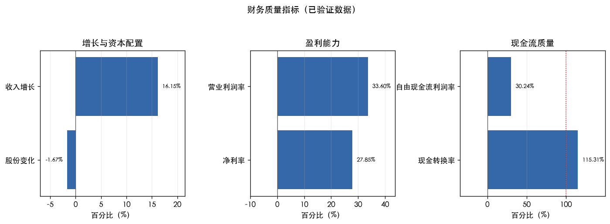
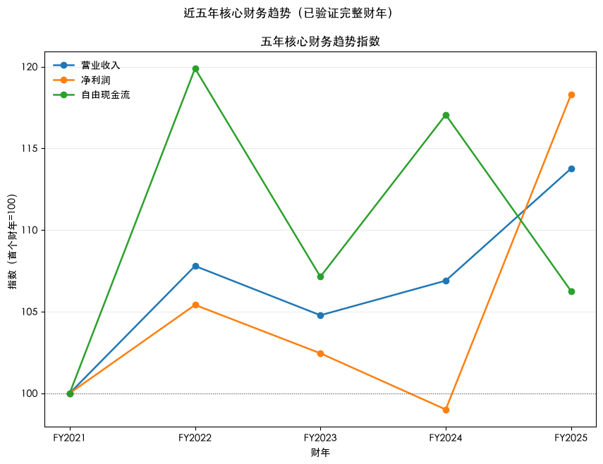
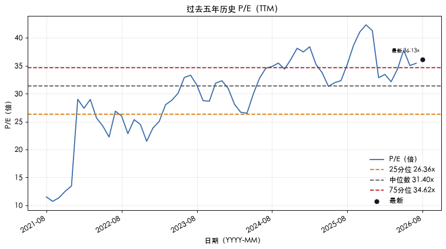

> 真实运行示例；运行开始：`2026-08-20T00:00:42.797842+08:00`。本文仅供技术演示，不构成投资建议。

# 投资研究报告：Apple Inc.（AAPL）

## 0. 封面与研究元数据

| 字段 | 内容 |
|---|---|
| 公司名称 | Apple Inc. |
| 股票代码 | AAPL |
| 研究期限 | 3年 |
| 研究 Profile | standard_operating / common_stock / domestic_us_gaap |
| 市场价格 | 315.02 USD |
| 市场价格币种 | USD |
| 市场价格时间戳 | 2026-08-19T17:23:23Z |
| 财务数据截止日 | 2026-06-27 |

## 1. 一页结论

- **经营质量：** 强
- **相对自身历史估值：** 偏高
- **市场隐含预期：** 高
- **研究动作：** 加入观察名单，等待估值回落或经营数据进一步验证

## 2. 公司与研究范围

### 研究范围
- 研究对象：Apple Inc.
- 股票代码：AAPL
- 请求研究期限：3年

- 净现金：-199.48 亿美元（截至 2026-06-27；来源：https://data.sec.gov/api/xbrl/companyfacts/CIK0000320193.json）

## 3. 最新经营状态

<!-- ## 公司质量 -->

- 营业利润率：33.60%（截至 2026-06-27；来源：https://data.sec.gov/api/xbrl/companyfacts/CIK0000320193.json）
- 净利率：27.85%（截至 2026-06-27；来源：https://data.sec.gov/api/xbrl/companyfacts/CIK0000320193.json）
- 自由现金流率：30.24%（截至 2026-06-27；来源：https://data.sec.gov/api/xbrl/companyfacts/CIK0000320193.json）
- 现金转换率：115.31%（截至 2026-06-27；来源：https://data.sec.gov/api/xbrl/companyfacts/CIK0000320193.json）

<!-- ## 财务趋势 -->

- 营业收入同比增长：16.15%（截至 2026-06-27；来源：https://data.sec.gov/api/xbrl/companyfacts/CIK0000320193.json）
- 股份稀释率：-1.67%（截至 2026-06-27；来源：https://data.sec.gov/api/xbrl/companyfacts/CIK0000320193.json）

*口径说明：收入增长、利润率和现金流质量是截至 2026-06-27 的财年年初至今累计（YTD）；股份变化是同比时点比较；后文 TTM 是最近十二个月。*

### TTM 财务规模（已验证）
- 营业收入：4668.23 亿美元（TTM；期间 2025-06-29 至 2026-06-27）
- 净利润：1289.30 亿美元（TTM；期间 2025-06-29 至 2026-06-27）
- 经营现金流：1467.24 亿美元（TTM；期间 2025-06-29 至 2026-06-27）
- 自由现金流：1366.83 亿美元（TTM；期间 2025-06-29 至 2026-06-27）

TTM 数据与完整财年数据期间不同，不可直接视为同一期数据。

完整财年范围：FY2021（2020-09-27）至 FY2025（2025-09-27）。

**图 1：最新经营质量**
- 研究问题：最新经营质量是否由盈利能力与现金转换共同支持？
- 期间：YTD同比 / YTD / 同比时点（2026-06-27）
- 单位：百分比（%）
- 来源：https://data.sec.gov/api/xbrl/companyfacts/CIK0000320193.json
- 截止：2026-06-27
- 观察：收入同比保持正增长；股份数量同比减少；营业利润率和净利率均为正；经营现金流高于净利润
- 投资含义：用于判断经营质量是否值得继续跟踪，不单独构成估值结论。
- 限制与反证：指标为已验证期间的口径比较，不能据此证明因果关系；缺少可比口径时以数据不足处理。
- 图表说明：三个面板分别展示增长与资本配置、盈利能力和现金流质量，并使用独立刻度。

## 4. 历史经营与财务质量

### 五年财务表（已验证完整财年）
| 指标 | FY2021 | FY2022 | FY2023 | FY2024 | FY2025 |
|---|---:|---:|---:|---:|---:|
| 营业收入 | 3658.17 亿美元 | 3943.28 亿美元 | 3832.85 亿美元 | 3910.35 亿美元 | 4161.61 亿美元 |
| 净利润 | 946.80 亿美元 | 998.03 亿美元 | 969.95 亿美元 | 937.36 亿美元 | 1120.10 亿美元 |
| 经营现金流 | 1040.38 亿美元 | 1221.51 亿美元 | 1105.43 亿美元 | 1182.54 亿美元 | 1114.82 亿美元 |
| 资本开支 | 110.85 亿美元 | 107.08 亿美元 | 109.59 亿美元 | 94.47 亿美元 | 127.15 亿美元 |
| 自由现金流 | 929.53 亿美元 | 1114.43 亿美元 | 995.84 亿美元 | 1088.07 亿美元 | 987.67 亿美元 |
- 收入 CAGR：3.28%
- 净利润 CAGR：4.29%
- FCF CAGR：1.53%

### 完整财年趋势（确定性汇总）
- 完整财年起止：FY2021（2020-09-27）至 FY2025（2025-09-27）
- 期间判断：整体增长但存在波动。
- 最新 FY 自由现金流较上一 FY 下降。

**图 2：五年核心财务趋势指数**
- 研究问题：五个完整财年的核心财务指标相对首年如何变化？
- 期间：FY2021（2020-09-27）至 FY2025（2025-09-27）
- 单位：指数（首个财年=100；基期=100）
- 来源：https://data.sec.gov/api/xbrl/companyfacts/CIK0000320193.json
- 截止：2025-10-31
- 观察：营业收入五年总体增长；净利润五年总体增长；自由现金流五年总体增长；五年自由现金流全部为正；最新自由现金流低于最新净利润
- 投资含义：用于比较跨财年的相对变化，绝对金额以五年财务表为准。
- 限制与反证：指数不显示绝对金额；首年值非正或无效时不生成，也不能替代五年财务表或证明因果关系。
- 图表说明：近五年核心财务趋势（已验证完整财年），展示最近五个共同完整财年；绝对金额由五年财务表承担，三条序列共享指数纵轴。

<!-- ## 当前估值 -->

## 5. 估值

### 当前估值

以下指标使用同一时点的市场价格和已验证财务数据计算。

- 市场价格：315.02 USD（截至 2026-08-19T17:23:23Z；来源：https://finance.yahoo.com/quote/AAPL）
- 市值：4.60 万亿美元（截至 2026-08-19T17:23:23Z；来源：https://finance.yahoo.com/quote/AAPL）
- P/E：36.13x（截至 2026-08-19T17:23:23Z；来源：https://finance.yahoo.com/quote/AAPL）
- FCF Yield：2.97%（截至 2026-08-19T17:23:23Z；来源：https://finance.yahoo.com/quote/AAPL）

### 历史估值

以下数据用于相对自身历史估值比较，不作绝对价格判断。

- 历史当前 P/E：36.13x（截至 2026-08-19；来源：https://finance.yahoo.com/quote/AAPL）
- 历史五年中位 P/E：31.40x（截至 2026-08-19；来源：https://finance.yahoo.com/quote/AAPL）
- 历史 P/E 二十五分位：26.36x（截至 2026-08-19；来源：https://finance.yahoo.com/quote/AAPL）
- 历史 P/E 七十五分位：34.62x（截至 2026-08-19；来源：https://finance.yahoo.com/quote/AAPL）
- 当前历史百分位：86.45%（截至 2026-08-19；来源：https://finance.yahoo.com/quote/AAPL）

**图 3：五年历史 P/E**
- 研究问题：当前 P/E 相对过去五年历史区间处于何处？
- 期间：过去五年历史序列
- 单位：P/E（倍）
- 来源：https://finance.yahoo.com/quote/AAPL
- 截止：2026-08-19
- 观察：当前市盈率高于五年中位数；当前市盈率位于或高于历史上四分位；当前估值位于历史样本上半区
- 投资含义：用于判断估值相对自身历史位置，不作绝对价格判断。
- 限制与反证：P/E 受盈利口径、样本日期和异常值影响，不代表未来收益；若历史摘要缺失则写数据不足。
- 图表说明：曲线展示 TTM P/E 的历史变化，参考线用于判断当前估值相对过去五年的位置。

### 反向 DCF

反向 DCF 从当前市场价格倒推出未来 10 年自由现金流年复合增长要求。

- 反向 DCF 隐含增长：12.54%（截至 2026-08-19T17:23:23Z；来源：https://finance.yahoo.com/quote/AAPL）

| 参数 | 数值 | 含义 |
|---|---:|---|
| 基础自由现金流（TTM，模型起点） | 1366.83 亿美元 | 最近十二个月自由现金流 |
| 基准折现率 | 9.00% | 将未来现金流折算到今天 |
| 预测年数 | 10 年 | 固定预测期限 |
| 基准永续增长率 | 2.50% | 预测期后的稳定增长假设 |
| 历史 FY FCF CAGR | 1.53% | 五个完整财年的历史复合增长 |
| 隐含增长率 | 12.54% | 未来 10 年自由现金流年复合增长要求 |
| 差值（百分点） | 11.01 个百分点 | 隐含增长率减历史 FY FCF CAGR |

情景矩阵（折现率 / 永续增长率 → 隐含增长率）：

| 折现率 | 永续增长率 | 隐含增长率 |
|---:|---:|---:|
| 8.00% | 2.00% | 10.87% |
| 9.00% | 2.50% | 12.54% |
| 10.00% | 3.00% | 14.16% |

方向性对照：历史 FY FCF CAGR 与反向 DCF 隐含增长率口径不同，仅作方向性对照，不是预测。

## 6. 主要风险与监控条件

| 风险 | 影响路径 | 监控指标 | 来源 |
|---|---|---|---|
| 公司从单一或有限来源获取某些组件，面临重大供应和定价风险；先进半导体、存储（NAND）和内存（DRAM）等组件存在行业性短缺和成本上升，预计该趋势将加剧，可能对收入、成本、毛利率、经营业绩和财务状况产生重大不利影响。 | 影响路径：成本上升可能压低毛利率并推高库存压力 | 监控指标：毛利率、库存周转与关税披露（观察项：毛利率、库存周转与关税披露） | 来源：https://www.sec.gov/Archives/edgar/data/320193/0000320193-26-000020-index.html |
| 公司业务（包括人工智能和机器学习）依赖足够的计算资源，云计算和AI基础设施需求大幅上升导致供应受限、交付周期延长和成本上升；若无法以商业合理条款获得足够算力，可能限制产品和服务功能、延迟新功能部署或导致运营成本显著增加。 | 影响路径：投入需求可能推高资本开支并影响毛利率 | 监控指标：资本开支、折旧与毛利率（观察项：资本开支、折旧与毛利率） | 来源：https://www.sec.gov/Archives/edgar/data/320193/0000320193-26-000020-index.html |
| 公司净销售额的很大一部分来自单一产品类别，该产品类别需求下滑可能显著影响净销售额和毛利率。 | 影响路径：需结合SEC风险更新判断财务影响 | 监控指标：SEC风险更新和对应财务指标（观察项：SEC风险更新和对应财务指标） | 来源：https://www.sec.gov/Archives/edgar/data/320193/0000320193-26-000013-index.html |

### 风险附录

展开查看其余风险（5 项）

| 风险 | 影响路径 | 监控指标 | 来源 |
|---|---|---|---|
| 公司硬件产品的客户购买决策部分取决于第三方软件应用和服务的可用性；若开发者停止开发或转向竞争平台，或采用替代分发和支付方式，公司可能失去或降低App Store佣金收入，对收入、毛利率、经营业绩和财务状况产生不利影响。 | 影响路径：监管变化可能影响服务收入并增加合规成本 | 监控指标：服务收入增速、佣金政策与合规费用（观察项：服务收入增速、佣金政策与合规费用） | 来源：https://www.sec.gov/Archives/edgar/data/320193/0000320193-26-000020-index.html |
| 公司在美国、欧盟及其他司法辖区面临反垄断调查和诉讼（包括针对App Store条款和佣金），并受欧盟DMA等竞争法规约束；若不利裁决或合规要求迫使公司改变业务实践、佣金被收窄或取消，可能面临重大罚款并对业务、经营业绩和财务状况产生重大不利影响。 | 影响路径：监管变化可能影响服务收入并增加合规成本 | 监控指标：服务收入增速、佣金政策与合规费用（观察项：服务收入增速、佣金政策与合规费用） | 来源：https://www.sec.gov/Archives/edgar/data/320193/0000320193-26-000020-index.html |
| 公司通过向Google等公司提供搜索服务的许可安排获取收入，该等安排受反垄断诉讼和补救措施影响；若上诉导致实施禁止Google向公司提供搜索分发商业条款等救济，可能实质损害公司从该等许可安排获得收入的能力。 | 影响路径：监管变化可能影响服务收入并增加合规成本 | 监控指标：服务收入增速、佣金政策与合规费用（观察项：服务收入增速、佣金政策与合规费用） | 来源：https://www.sec.gov/Archives/edgar/data/320193/0000320193-26-000020-index.html |
| 公司受日益增多的美国及国际个人数据收集、使用和跨境传输法律约束，中国数据处理和本地化监管要求可能限制公司将数据传输到境外；合规成本上升或业务实践改变可能损害声誉和竞争力，非合规可能导致吊销业务执照、重大罚款和法律责任。 | 影响路径：监管变化可能影响服务收入并增加合规成本 | 监控指标：服务收入增速、佣金政策与合规费用（观察项：服务收入增速、佣金政策与合规费用） | 来源：https://www.sec.gov/Archives/edgar/data/320193/0000320193-26-000020-index.html |
| 公司净销售额和毛利率面临波动和下行压力，因素包括新征或提高的关税及其他贸易限制及其整体规模和持续时间、报复性行动，以及外汇汇率波动、通胀等宏观经济压力。 | 影响路径：成本上升可能压低毛利率并推高库存压力 | 监控指标：毛利率、库存周转与关税披露（观察项：毛利率、库存周转与关税披露） | 来源：https://www.sec.gov/Archives/edgar/data/320193/0000320193-26-000013-index.html |

## 7. 综合判断与重新评估条件

### 已验证事实
- 经营质量：强

### 确定性比较
- 相对自身历史估值：偏高
- 市场隐含预期：高

### 确定性判断
- 研究动作：加入观察名单，等待估值回落或经营数据进一步验证

### 重新评估条件
- P/E 回到历史中位数（31.40x）附近。
- 出现收入/FCF 增长证据（收入增长与自由现金流增长）。

## 8. 数据来源、方法与技术附录

来源口径：SEC 申报中的年度及季度数据、已验证计算和市场数据；季度数据可能未经审计。

- https://data.sec.gov/api/xbrl/companyfacts/CIK0000320193.json
- https://finance.yahoo.com/quote/AAPL

### 方法与审计元数据
- 确定性状态：status=ready
- Profile：issuer=standard_operating; security=common_stock; reporting=domestic_us_gaap
- 覆盖范围：full
- Policy version：metric-policy:v1
- 触发规则：估值偏高规则触发
- 触发规则代码：high_valuation

### 判断规则
- 经营质量：营业利润率、净利率、FCF margin 均大于 0 且现金转换率至少为 100% 为强；三项率均大于 0 但现金转换率低于 100% 为一般；任一率不大于 0 为弱；缺少关键数据为数据不足。
- 相对自身历史估值：当前 P/E 达到或超过历史 75 分位为偏高，达到或低于 25 分位为偏低，其余为中性；缺少数据为数据不足。
- 市场隐含预期：反向 DCF 隐含增长率减去历史 FY FCF CAGR，至少 5 个百分点为高，至多负 5 个百分点为低，其余为中性；缺少数据为数据不足。该差值仅作方向性对照，不是预测。
- 研究动作：经营质量弱时停止深入研究；关键数据不足时等待补充证据；其余情况加入观察名单并跟踪关键指标。

### 术语说明
- P/E（市盈率）：股价相对于每股收益的倍数，用于描述市场对盈利的定价。
- FCF Yield（自由现金流收益率）：自由现金流相对于市值的收益率。
- TTM（过去十二个月）：以最近连续十二个月为口径汇总经营数据。
- DCF（现金流折现）：将未来现金流折算到当前价值的估值方法。
- 反向 DCF（由市场价格倒推隐含增长）：在给定模型期限内，从当前市场价格反推出自由现金流年复合增长要求。

## 9. 非投资建议声明

本文内容不构成、不提供也不代表任何投资建议、投资推荐或买卖建议；文中出现的买入、卖出、持有等词语仅用于免责声明，不构成任何投资结论。
