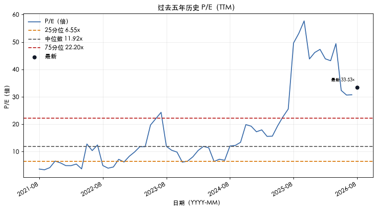

> 真实运行示例；运行开始：`2026-08-20T01:25:36.154422+08:00`。本文仅供技术演示，不构成投资建议。

# 投资研究报告：NVIDIA CORP（NVDA）

## 0. 封面与研究元数据

| 字段 | 内容 |
|---|---|
| 公司名称 | NVIDIA CORP |
| 股票代码 | NVDA |
| 研究期限 | 3 years |
| 研究 Profile | standard_operating / common_stock / domestic_us_gaap |
| 市场价格 | 218.95 USD |
| 市场价格币种 | USD |
| 市场价格时间戳 | 2026-08-19T17:26:45Z |
| 财务数据截止日 | 2026-04-26 |

## 1. 一页结论

- **经营质量：** 一般
- **相对自身历史估值：** 偏高
- **市场隐含预期：** 数据不足
- **研究动作：** 等待补充证据

## 2. 公司与研究范围

### 研究范围
- 研究对象：NVIDIA CORP
- 股票代码：NVDA
- 请求研究期限：3 years

- 净现金：538.89 亿美元（截至 2026-04-26；来源：https://data.sec.gov/api/xbrl/companyfacts/CIK0001045810.json）

## 3. 最新经营状态

<!-- ## 公司质量 -->

- 营业利润率：65.60%（截至 2026-04-26；来源：https://data.sec.gov/api/xbrl/companyfacts/CIK0001045810.json）
- 净利率：71.46%（截至 2026-04-26；来源：https://data.sec.gov/api/xbrl/companyfacts/CIK0001045810.json）
- 自由现金流率：59.53%（截至 2026-04-26；来源：https://data.sec.gov/api/xbrl/companyfacts/CIK0001045810.json）
- 现金转换率：86.32%（截至 2026-04-26；来源：https://data.sec.gov/api/xbrl/companyfacts/CIK0001045810.json）

<!-- ## 财务趋势 -->

- 营业收入同比增长：85.23%（截至 2026-04-26；来源：https://data.sec.gov/api/xbrl/companyfacts/CIK0001045810.json）
- 股份稀释率：-0.63%（截至 2026-04-26；来源：https://data.sec.gov/api/xbrl/companyfacts/CIK0001045810.json）

*口径说明：收入增长、利润率和现金流质量是截至 2026-04-26 的财年年初至今累计（YTD）；股份变化是同比时点比较；后文 TTM 是最近十二个月。*

### TTM 财务规模（已验证）
- 营业收入：2534.91 亿美元（TTM；期间 2025-04-28 至 2026-04-26）
- 净利润：1596.13 亿美元（TTM；期间 2025-04-28 至 2026-04-26）
- 经营现金流：1256.48 亿美元（TTM；期间 2025-04-28 至 2026-04-26）
- 自由现金流：1190.76 亿美元（TTM；期间 2025-04-28 至 2026-04-26）

## 4. 历史经营与财务质量

### 五年财务表（已验证完整财年）

数据不足。

### 完整财年趋势

数据不足。

<!-- ## 当前估值 -->

## 5. 估值

### 当前估值

以下指标使用同一时点的市场价格和已验证财务数据计算。

- 市场价格：218.95 USD（截至 2026-08-19T17:26:45Z；来源：https://finance.yahoo.com/quote/NVDA）
- 市值：5.32 万亿美元（截至 2026-08-19T17:26:45Z；来源：https://finance.yahoo.com/quote/NVDA）
- P/E：33.53x（截至 2026-08-19T17:26:45Z；来源：https://finance.yahoo.com/quote/NVDA）
- FCF Yield：2.24%（截至 2026-08-19T17:26:45Z；来源：https://finance.yahoo.com/quote/NVDA）

### 历史估值

以下数据用于相对自身历史估值比较，不作绝对价格判断。

- 历史当前 P/E：33.53x（截至 2026-08-19；来源：https://finance.yahoo.com/quote/NVDA）
- 历史五年中位 P/E：11.92x（截至 2026-08-19；来源：https://finance.yahoo.com/quote/NVDA）
- 历史 P/E 二十五分位：6.55x（截至 2026-08-19；来源：https://finance.yahoo.com/quote/NVDA）
- 历史 P/E 七十五分位：22.20x（截至 2026-08-19；来源：https://finance.yahoo.com/quote/NVDA）
- 当前历史百分位：84.93%（截至 2026-08-19；来源：https://finance.yahoo.com/quote/NVDA）

**图 3：五年历史 P/E**
- 研究问题：当前 P/E 相对过去五年历史区间处于何处？
- 期间：过去五年历史序列
- 单位：P/E（倍）
- 来源：https://finance.yahoo.com/quote/NVDA
- 截止：2026-08-19
- 观察：当前市盈率高于五年中位数；当前市盈率位于或高于历史上四分位；当前估值位于历史样本上半区
- 投资含义：用于判断估值相对自身历史位置，不作绝对价格判断。
- 限制与反证：P/E 受盈利口径、样本日期和异常值影响，不代表未来收益；若历史摘要缺失则写数据不足。
- 图表说明：曲线展示 TTM P/E 的历史变化，参考线用于判断当前估值相对过去五年的位置。

### 反向 DCF

反向 DCF 从当前市场价格倒推出未来 10 年自由现金流年复合增长要求。

- 反向 DCF 隐含增长：16.29%（截至 2026-08-19T17:26:45Z；来源：https://finance.yahoo.com/quote/NVDA）

| 参数 | 数值 | 含义 |
|---|---:|---|
| 基础自由现金流（TTM，模型起点） | 1190.76 亿美元 | 最近十二个月自由现金流 |
| 基准折现率 | 9.00% | 将未来现金流折算到今天 |
| 预测年数 | 10 年 | 固定预测期限 |
| 基准永续增长率 | 2.50% | 预测期后的稳定增长假设 |
| 历史 FY FCF CAGR | 不可用 | 五个完整财年的历史复合增长 |
| 隐含增长率 | 16.29% | 未来 10 年自由现金流年复合增长要求 |
| 差值（百分点） | 不可用 | 隐含增长率减历史 FY FCF CAGR |

情景矩阵（折现率 / 永续增长率 → 隐含增长率）：

| 折现率 | 永续增长率 | 隐含增长率 |
|---:|---:|---:|
| 8.00% | 2.00% | 14.55% |
| 9.00% | 2.50% | 16.29% |
| 10.00% | 3.00% | 17.98% |

方向性对照：历史 FY FCF CAGR 与反向 DCF 隐含增长率口径不同，仅作方向性对照，不是预测。

## 6. 主要风险与监控条件

| 风险 | 影响路径 | 监控指标 | 来源 |
|---|---|---|---|
| 公司依赖第三方晶圆代工厂、封装测试和组装供应商，缺乏对产品数量、质量、交付排期的直接控制；供应商数量有限且地理集中，叠加超过12个月的制造前置期和不保证的产能供应，可能在供应受限时损害满足客户需求、扩大供应链及经营业绩的能力。 | 影响路径：成本上升可能压低毛利率并推高库存压力 | 监控指标：毛利率、库存周转与关税披露（观察项：毛利率、库存周转与关税披露） | 来源：https://www.sec.gov/Archives/edgar/data/1045810/0001045810-26-000021-index.html |
| 公司为锁定产能支付溢价、提供预付款并签订长期供应与产能承诺，若需求估计不准确或客户取消/推迟订单，无法及时按同等速度削减供应承诺，可能产生超额库存、存货减值、取消费用和资产减值，进而损害毛利率和财务业绩。 | 影响路径：需结合SEC风险更新判断财务影响 | 监控指标：SEC风险更新和对应财务指标（观察项：SEC风险更新和对应财务指标） | 来源：https://www.sec.gov/Archives/edgar/data/1045810/0001045810-26-000021-index.html、https://www.sec.gov/Archives/edgar/data/1045810/0001045810-26-000052-index.html |
| 公司收入高度集中于有限数量的直接与间接客户：2026财年单一直接客户占收入22%、另一直接客户占14%，且部分间接客户估计各占收入10%以上；客户订单大多按采购订单进行，可在很少通知且无罚款的情况下取消、更改或延迟，失去大客户或被贸易限制阻止销售将损害财务业绩。 | 影响路径：成本上升可能压低毛利率并推高库存压力 | 监控指标：毛利率、库存周转与关税披露（观察项：毛利率、库存周转与关税披露） | 来源：https://www.sec.gov/Archives/edgar/data/1045810/0001045810-26-000021-index.html |

### 风险附录

展开查看其余风险（7 项）

| 风险 | 影响路径 | 监控指标 | 来源 |
|---|---|---|---|
| 公司持续受到美国及外国政府不断变化和扩大的出口管制限制：2025年4月美国对H20及达到其内存带宽/互连带宽的芯片实施对华及D:5国家许可要求，导致2026财年第一季度就H20超额库存和采购义务确认45亿美元费用；截至2026财年末公司实质上被排除在中国数据中心计算市场之外。 | 影响路径：需结合SEC风险更新判断财务影响 | 监控指标：SEC风险更新和对应财务指标（观察项：SEC风险更新和对应财务指标） | 来源：https://www.sec.gov/Archives/edgar/data/1045810/0001045810-26-000021-index.html、https://www.sec.gov/Archives/edgar/data/1045810/0001045810-26-000052-index.html、https://www.sec.gov/Archives/edgar/data/1045810/0001045810-25-000230-index.html |
| 出口管制可能导致库存过剩、采购义务相关费用、供应链与分销渠道中断，并促使海外客户和政府对美国半导体实施'design-out'或转向竞争对手，使公司在全球（包括欧洲、拉美、东南亚）市场面临竞争劣势和长期业务、营收及财务结果受损。 | 影响路径：成本上升可能压低毛利率并推高库存压力 | 监控指标：毛利率、库存周转与关税披露（观察项：毛利率、库存周转与关税披露） | 来源：https://www.sec.gov/Archives/edgar/data/1045810/0001045810-26-000021-index.html、https://www.sec.gov/Archives/edgar/data/1045810/0001045810-25-000209-index.html |
| 公司在中国面临监管风险：2025年9月15日中国反垄断监管机构发布初步认定，认为公司遵守美国出口管制而向中国市场提供降级产品，对华客户构成不公平歧视并违反Mellanox收购获批条件；若最终认定违规，公司可能面临罚款、业务限制或对网络业务的限制，对经营产生重大不利影响。 | 影响路径：监管变化可能影响服务收入并增加合规成本 | 监控指标：服务收入增速、佣金政策与合规费用（观察项：服务收入增速、佣金政策与合规费用） | 来源：https://www.sec.gov/Archives/edgar/data/1045810/0001045810-26-000021-index.html、https://www.sec.gov/Archives/edgar/data/1045810/0001045810-26-000052-index.html |
| 公司业务依赖台湾、韩国等地的海外供应商持续稳定供应，且产品零部件制造与最终组装集中在中国、香港、以色列、韩国和台湾等地区；地缘政治紧张、冲突或任何影响这些地区供应的新限制，都可能对业务、财务业绩造成重大不利影响。 | 影响路径：需结合SEC风险更新判断财务影响 | 监控指标：SEC风险更新和对应财务指标（观察项：SEC风险更新和对应财务指标） | 来源：https://www.sec.gov/Archives/edgar/data/1045810/0001045810-26-000021-index.html、https://www.sec.gov/Archives/edgar/data/1045810/0001045810-25-000023-index.html |
| 公司约31%（2026财年）至53%（2025财年）的收入来自美国以外地区，国际销售与运营面临贸易关税、制裁、进出口管制、货币波动、地缘政治及灾难性事件等风险；例如2026财年2月获批的H200对华许可出货需在美国境内接受检验并承担25%进口关税，可能无法将关税转嫁给客户。 | 影响路径：成本上升可能压低毛利率并推高库存压力 | 监控指标：毛利率、库存周转与关税披露（观察项：毛利率、库存周转与关税披露） | 来源：https://www.sec.gov/Archives/edgar/data/1045810/0001045810-26-000021-index.html、https://www.sec.gov/Archives/edgar/data/1045810/0001045810-25-000023-index.html、https://www.sec.gov/Archives/edgar/data/1045810/0001045810-26-000052-index.html |
| 公司面临全球监管审查与合规负担：其在AI相关市场的地位引发欧盟、美国、英国、韩国、日本和中国等地竞争监管机构的关注与信息索取，包括法国竞争管理局对显卡和云服务提供商市场的调查；EU AI Act及各州AI法规可能限制其训练、部署或发布AI模型的能力并增加合规成本。 | 影响路径：监管变化可能影响服务收入并增加合规成本 | 监控指标：服务收入增速、佣金政策与合规费用（观察项：服务收入增速、佣金政策与合规费用） | 来源：https://www.sec.gov/Archives/edgar/data/1045810/0001045810-26-000021-index.html、https://www.sec.gov/Archives/edgar/data/1045810/0001045810-25-000116-index.html |
| 2026年6月公司完成合计250亿美元的多系列票据发行（2028-2056年到期），新增大规模长期债务，叠加此前9.7亿美元票据余额（2024财年），未来需承担偿债义务与利息支出，若再融资条款不利或信用评级变化，可能影响财务灵活性与经营。 | 影响路径：需结合SEC风险更新判断财务影响 | 监控指标：SEC风险更新和对应财务指标（观察项：SEC风险更新和对应财务指标） | 来源：https://www.sec.gov/Archives/edgar/data/1045810/0001193125-26-275783-index.html、https://www.sec.gov/Archives/edgar/data/1045810/0001045810-24-000029-index.html |

## 7. 综合判断与重新评估条件

### 已验证事实
- 经营质量：一般

### 确定性比较
- 相对自身历史估值：偏高
- 市场隐含预期：数据不足

### 确定性判断
- 研究动作：等待补充证据

### 重新评估条件
- P/E 回到历史中位数（11.92x）附近。
- 出现收入/FCF 增长证据（收入增长与自由现金流增长）。

## 8. 数据来源、方法与技术附录

来源口径：SEC 申报中的年度及季度数据、已验证计算和市场数据；季度数据可能未经审计。

- https://data.sec.gov/api/xbrl/companyfacts/CIK0001045810.json
- https://finance.yahoo.com/quote/NVDA

### 方法与审计元数据
- 确定性状态：status=ready
- Profile：issuer=standard_operating; security=common_stock; reporting=domestic_us_gaap
- 覆盖范围：full
- Policy version：metric-policy:v1
- 触发规则：估值偏高规则触发
- 触发规则代码：high_valuation

### 判断规则
- 经营质量：营业利润率、净利率、FCF margin 均大于 0 且现金转换率至少为 100% 为强；三项率均大于 0 但现金转换率低于 100% 为一般；任一率不大于 0 为弱；缺少关键数据为数据不足。
- 相对自身历史估值：当前 P/E 达到或超过历史 75 分位为偏高，达到或低于 25 分位为偏低，其余为中性；缺少数据为数据不足。
- 市场隐含预期：反向 DCF 隐含增长率减去历史 FY FCF CAGR，至少 5 个百分点为高，至多负 5 个百分点为低，其余为中性；缺少数据为数据不足。该差值仅作方向性对照，不是预测。
- 研究动作：经营质量弱时停止深入研究；关键数据不足时等待补充证据；其余情况加入观察名单并跟踪关键指标。

### 术语说明
- P/E（市盈率）：股价相对于每股收益的倍数，用于描述市场对盈利的定价。
- FCF Yield（自由现金流收益率）：自由现金流相对于市值的收益率。
- TTM（过去十二个月）：以最近连续十二个月为口径汇总经营数据。
- DCF（现金流折现）：将未来现金流折算到当前价值的估值方法。
- 反向 DCF（由市场价格倒推隐含增长）：在给定模型期限内，从当前市场价格反推出自由现金流年复合增长要求。

## 9. 非投资建议声明

本文内容不构成、不提供也不代表任何投资建议、投资推荐或买卖建议。读者应独立判断并自行承担决策风险。
